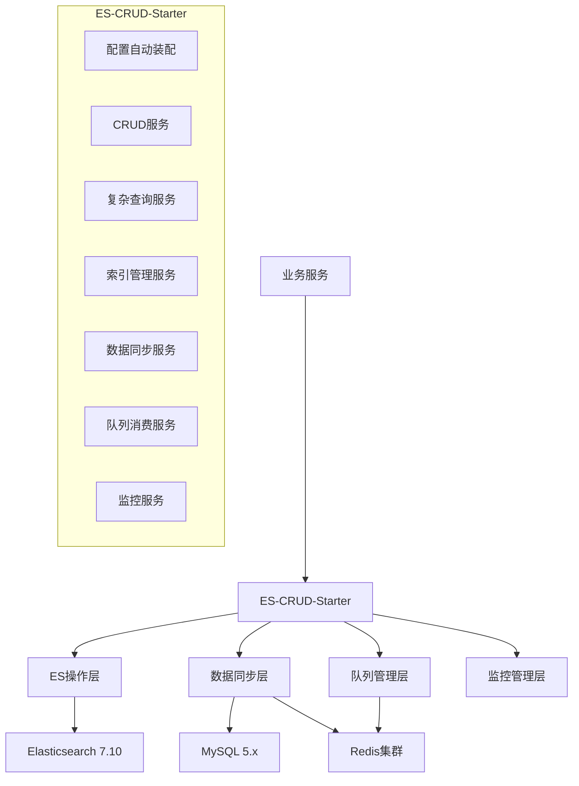

# Elasticsearch高性能增删改查组件设计文档

## 概述

本设计文档描述了一个基于Spring Data Elasticsearch的高性能增删改查组件的架构设计。该组件作为starter提供给其他微服务使用，支持ES 7.10版本和Spring Boot 2.7.x版本，提供完整的数据同步、查询、索引管理等功能。

## 架构设计

### 整体架构



### 技术选型决策

1. **队列选择：Redis集群**
   - 理由：性能优异，内存操作，支持持久化
   - 大厂实践：阿里、腾讯等广泛使用Redis作为消息队列
   - 可靠性：支持AOF/RDB持久化，集群模式高可用

2. **数据同步策略：全量+增量**
   - 全量同步：适合初始化和定期校验
   - 增量同步：基于时间戳，实时性好
   - 断点续传：支持失败重试和进度恢复

3. **索引设计：Keyword优化**
   - 所有字符串字段默认使用keyword类型
   - 避免不必要的分词，提高查询性能
   - 支持精确匹配和聚合操作

## 组件和接口设计

### 核心组件

#### 1. ElasticsearchCrudService
```java
public interface ElasticsearchCrudService<T> {
    // 基础CRUD操作
    T save(T entity);
    List<T> saveAll(List<T> entities);
    Optional<T> findById(String id);
    void deleteById(String id);
    void deleteByIds(List<String> ids);
    T update(String id, T entity);
    
    // 分页查询
    Page<T> findAll(Pageable pageable);
    Page<T> search(SearchRequest request, Pageable pageable);
}
```

#### 2. ElasticsearchComplexQueryService
```java
public interface ElasticsearchComplexQueryService {
    // 复杂查询
    <T> List<T> nestedQuery(NestedQueryRequest request, Class<T> clazz);
    <T> List<T> parentChildQuery(ParentChildQueryRequest request, Class<T> clazz);
    <T> List<T> multiIndexQuery(MultiIndexQueryRequest request, Class<T> clazz);
    
    // 聚合查询
    AggregationResult aggregation(AggregationRequest request);
}
```

#### 3. ElasticsearchIndexService
```java
public interface ElasticsearchIndexService {
    // 索引管理
    List<IndexInfo> listIndices();
    boolean createIndex(CreateIndexRequest request);
    boolean deleteIndex(String indexName);
    
    // 备份恢复
    boolean createSnapshot(SnapshotRequest request);
    boolean restoreSnapshot(RestoreRequest request);
    
    // 状态监控
    IndexHealth getIndexHealth(String indexName);
    ClusterHealth getClusterHealth();
}
```

#### 4. DataSyncService
```java
public interface DataSyncService {
    // MySQL到ES同步
    SyncResult syncFromMysqlToEs(SyncRequest request);
    SyncResult incrementalSyncFromMysql(IncrementalSyncRequest request);
    
    // ES到MySQL同步
    SyncResult syncFromEsToMysql(SyncRequest request);
    SyncResult incrementalSyncFromEs(IncrementalSyncRequest request);
    
    // 数据对比
    ComparisonResult compareData(ComparisonRequest request);
}
```

#### 5. QueueSyncService
```java
public interface QueueSyncService {
    // 队列操作
    void sendSyncTask(SyncTask task);
    void consumeSyncTask();
    
    // 监控
    QueueStatus getQueueStatus();
    List<SyncTask> getFailedTasks();
}
```

### 配置类设计

#### ElasticsearchCrudProperties
```java
@ConfigurationProperties(prefix = "elasticsearch.crud")
public class ElasticsearchCrudProperties {
    private String hosts = "localhost:9200";
    private String username;
    private String password;
    private int connectionTimeout = 5000;
    private int socketTimeout = 60000;
    
    // 同步配置
    private SyncConfig sync = new SyncConfig();
    
    // 队列配置
    private QueueConfig queue = new QueueConfig();
    
    // 租户配置
    private TenantConfig tenant = new TenantConfig();
}
```

## 数据模型设计

### 基础实体模型
```java
@Document(indexName = "#{@tenantIndexResolver.resolve()}")
public abstract class BaseEsEntity {
    @Id
    private String id;
    
    @Field(type = FieldType.Keyword)
    private String tenantId;
    
    @Field(type = FieldType.Date)
    private LocalDateTime createTime;
    
    @Field(type = FieldType.Date)
    private LocalDateTime updateTime;
    
    @Field(type = FieldType.Long)
    private Long version;
}
```

### 同步任务模型
```java
public class SyncTask {
    private String taskId;
    private SyncType syncType; // MYSQL_TO_ES, ES_TO_MYSQL
    private SyncMode syncMode; // FULL, INCREMENTAL
    private String sourceTable;
    private String targetIndex;
    private String tenantId;
    private Map<String, Object> conditions;
    private SyncStatus status;
    private String errorMessage;
    private LocalDateTime createTime;
    private LocalDateTime startTime;
    private LocalDateTime endTime;
}
```

### 索引映射模板
```java
public class IndexMappingTemplate {
    public static final String KEYWORD_MAPPING = """
        {
          "mappings": {
            "properties": {
              "tenantId": {"type": "keyword"},
              "createTime": {"type": "date"},
              "updateTime": {"type": "date"},
              "version": {"type": "long"}
            }
          },
          "settings": {
            "number_of_shards": 3,
            "number_of_replicas": 1,
            "refresh_interval": "1s"
          }
        }
        """;
}
```

## 错误处理设计

### 异常层次结构
```java
public class ElasticsearchCrudException extends RuntimeException {
    private final ErrorCode errorCode;
    private final String details;
}

public enum ErrorCode {
    INDEX_NOT_FOUND("ES001", "索引不存在"),
    DOCUMENT_NOT_FOUND("ES002", "文档不存在"),
    SYNC_FAILED("ES003", "数据同步失败"),
    QUEUE_ERROR("ES004", "队列操作失败"),
    MAPPING_ERROR("ES005", "字段映射错误");
}
```

### 重试机制
```java
@Component
public class RetryableOperationExecutor {
    @Retryable(value = {ElasticsearchException.class}, 
               maxAttempts = 3, 
               backoff = @Backoff(delay = 1000))
    public <T> T executeWithRetry(Supplier<T> operation) {
        return operation.get();
    }
}
```

## 测试策略

### 单元测试
- 使用Testcontainers启动ES测试容器
- Mock外部依赖（MySQL、Redis）
- 覆盖所有核心业务逻辑

### 集成测试
- 使用真实的ES集群进行测试
- 测试数据同步的完整流程
- 验证租户隔离功能

### 性能测试
- 批量操作性能测试
- 复杂查询性能测试
- 并发同步性能测试

## 监控和运维

### 监控指标
```java
@Component
public class ElasticsearchMetrics {
    private final MeterRegistry meterRegistry;
    
    // 操作计数器
    private final Counter saveCounter;
    private final Counter queryCounter;
    private final Counter syncCounter;
    
    // 性能计时器
    private final Timer saveTimer;
    private final Timer queryTimer;
    private final Timer syncTimer;
    
    // 错误统计
    private final Counter errorCounter;
}
```

### 健康检查
```java
@Component
public class ElasticsearchHealthIndicator implements HealthIndicator {
    @Override
    public Health health() {
        try {
            ClusterHealthResponse response = elasticsearchClient.cluster().health();
            return Health.up()
                    .withDetail("cluster", response.getClusterName())
                    .withDetail("status", response.getStatus())
                    .withDetail("nodes", response.getNumberOfNodes())
                    .build();
        } catch (Exception e) {
            return Health.down(e).build();
        }
    }
}
```

## 租户支持设计

### 租户索引解析器
```java
@Component
public class TenantIndexResolver {
    public String resolve() {
        String tenantId = TenantContext.getCurrentTenantId();
        return "tenant_" + tenantId + "_data";
    }
    
    public String resolve(String baseIndexName) {
        String tenantId = TenantContext.getCurrentTenantId();
        return baseIndexName + "_tenant_" + tenantId;
    }
}
```

### 租户数据隔离
```java
@Aspect
@Component
public class TenantDataIsolationAspect {
    @Around("@annotation(TenantIsolated)")
    public Object addTenantFilter(ProceedingJoinPoint joinPoint) throws Throwable {
        // 自动添加租户过滤条件
        Object[] args = joinPoint.getArgs();
        for (Object arg : args) {
            if (arg instanceof SearchRequest) {
                addTenantFilter((SearchRequest) arg);
            }
        }
        return joinPoint.proceed(args);
    }
}
```

## 配置示例

### application.yml配置
```yaml
elasticsearch:
  crud:
    hosts: localhost:9200,localhost:9201,localhost:9202
    username: elastic
    password: password
    connection-timeout: 5000
    socket-timeout: 60000
    
    # 同步配置
    sync:
      batch-size: 1000
      thread-pool-size: 10
      retry-times: 3
      
    # 队列配置  
    queue:
      type: redis
      redis:
        key-prefix: "es:sync:"
        max-retry: 3
        
    # 租户配置
    tenant:
      enabled: true
      index-prefix: "tenant_"
      
# Redis配置
spring:
  redis:
    cluster:
      nodes: localhost:7000,localhost:7001,localhost:7002
    password: password
    timeout: 3000
```

## 部署架构

### Docker部署
```yaml
version: '3.8'
services:
  elasticsearch:
    image: elasticsearch:7.10.2
    environment:
      - cluster.name=es-cluster
      - node.name=es-node-1
      - discovery.type=single-node
    ports:
      - "9200:9200"
      
  redis:
    image: redis:6.2-alpine
    ports:
      - "6379:6379"
      
  mysql:
    image: mysql:5.7
    environment:
      MYSQL_ROOT_PASSWORD: password
    ports:
      - "3306:3306"
```

## 性能优化策略

### 批量操作优化
- 使用bulk API进行批量操作
- 合理设置批次大小（建议1000-5000）
- 异步处理提高吞吐量

### 查询优化
- 使用keyword类型避免分词
- 合理使用过滤器而非查询
- 启用查询缓存

### 索引优化
- 合理设置分片数量
- 定期优化索引（force merge）
- 使用索引模板统一配置

这个设计涵盖了所有需求，采用了最佳实践的架构模式，确保了高性能、高可用和易维护性。