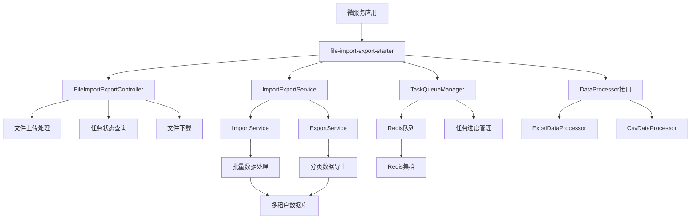

# 文件导入导出公共模块设计文档

## 概述

file-import-export-starter是一个独立的Spring Boot Starter模块，提供高性能的Excel/CSV文件导入导出功能。该模块基于现有的com.tenant.cvs功能进行重构和优化，支持多租户、Redis队列、异步处理和跨平台部署。

## 架构

### 整体架构图



### 模块结构

```
file-import-export-starter/
├── src/main/java/com/common/fileio/
│   ├── config/                    # 自动配置类
│   │   ├── FileImportExportAutoConfiguration.java
│   │   ├── FileImportExportProperties.java
│   │   └── ThreadPoolConfiguration.java
│   ├── controller/                # 控制器
│   │   └── FileImportExportController.java
│   ├── service/                   # 服务层
│   │   ├── ImportService.java
│   │   ├── ExportService.java
│   │   └── TaskManagementService.java
│   ├── queue/                     # 队列管理
│   │   ├── TaskQueueManager.java
│   │   └── RedisTaskQueue.java
│   ├── processor/                 # 数据处理器
│   │   ├── DataProcessor.java
│   │   ├── ExcelDataProcessor.java
│   │   ├── CsvDataProcessor.java
│   │   └── ProcessorContext.java
│   ├── model/                     # 数据模型
│   │   ├── ImportExportTask.java
│   │   ├── TaskProgress.java
│   │   ├── FileInfo.java
│   │   └── ProcessResult.java
│   ├── util/                      # 工具类
│   │   ├── FileUtils.java
│   │   ├── ExcelUtils.java
│   │   ├── CsvUtils.java
│   │   └── PathUtils.java
│   └── exception/                 # 异常处理
│       ├── FileProcessException.java
│       └── TaskNotFoundException.java
├── src/main/resources/
│   ├── META-INF/spring.factories   # 自动配置
│   └── application-fileio.yml      # 默认配置
└── pom.xml
```

## 组件和接口

### 1. 自动配置组件

#### FileImportExportAutoConfiguration
```java
@Configuration
@EnableConfigurationProperties(FileImportExportProperties.class)
@ConditionalOnProperty(prefix = "file.import.export", name = "enabled", havingValue = "true", matchIfMissing = true)
public class FileImportExportAutoConfiguration {
    // 自动配置所有必要的Bean
}
```

#### FileImportExportProperties
```java
@ConfigurationProperties(prefix = "file.import.export")
public class FileImportExportProperties {
    private boolean enabled = true;
    private Import importConfig = new Import();
    private Export exportConfig = new Export();
    private Redis redis = new Redis();
    private Path path = new Path();
    
    public static class Import {
        private int maxBatchSize = 20000;
        private int maxFiles = 20;
        private int concurrent = 1;
    }
    
    public static class Export {
        private int maxBatchSize = 50000;
        private int concurrent = 10;
    }
    
    public static class Path {
        private String uploadDir = System.getProperty("os.name").toLowerCase().contains("win") 
            ? "C:\\Users\\lm\\Downloads\\uploads" 
            : "/tmp/uploads";
        private String exportDir = System.getProperty("os.name").toLowerCase().contains("win") 
            ? "C:\\Users\\lm\\Downloads\\exports" 
            : "/tmp/exports";
    }
}
```

### 2. 控制器组件

#### FileImportExportController
```java
@RestController
@RequestMapping("/api/file-io")
@Api(tags = "文件导入导出", description = "通用文件导入导出功能")
public class FileImportExportController {
    
    @PostMapping("/import")
    @TenantSwitchHeader(headerName = "X-Tenant-ID")
    public ResponseEntity<ApiResponse<String>> importFiles(
        @RequestParam("files") List<MultipartFile> files,
        @RequestParam(value = "type", defaultValue = "excel") String type,
        @RequestParam(value = "processor") String processorName,
        @RequestHeader("X-Tenant-ID") String tenantId);
    
    @PostMapping("/export")
    @TenantSwitchHeader(headerName = "X-Tenant-ID")
    public ResponseEntity<ApiResponse<String>> exportData(
        @RequestBody ExportRequest request,
        @RequestHeader("X-Tenant-ID") String tenantId);
    
    @GetMapping("/progress/{taskId}")
    public ResponseEntity<ApiResponse<TaskProgress>> getProgress(@PathVariable String taskId);
    
    @PostMapping("/stop/{taskId}")
    public ResponseEntity<ApiResponse<String>> stopTask(@PathVariable String taskId);
    
    @DeleteMapping("/delete/{taskId}")
    public ResponseEntity<ApiResponse<String>> deleteTask(@PathVariable String taskId);
    
    @GetMapping("/download/{taskId}")
    public void downloadFile(@PathVariable String taskId, HttpServletResponse response);
}
```

### 3. 服务层组件

#### ImportService
```java
@Service
public class ImportService {
    
    public String submitImportTask(ImportRequest request);
    
    public void processImportTask(ImportExportTask task);
    
    private void processFile(String filePath, String processorName, ImportExportTask task);
    
    private void saveBatch(List<Object> batch, DataProcessor processor, ImportExportTask task);
}
```

#### ExportService
```java
@Service
public class ExportService {
    
    public String submitExportTask(ExportRequest request);
    
    public void processExportTask(ImportExportTask task);
    
    private void exportToFile(String filePath, String processorName, ImportExportTask task);
}
```

### 4. 数据处理器接口

#### DataProcessor
```java
public interface DataProcessor<T> {
    
    /**
     * 解析文件数据为实体对象
     */
    List<T> parseFileData(String filePath, String fileType);
    
    /**
     * 批量保存数据
     */
    void saveBatch(List<T> entities);
    
    /**
     * 查询导出数据
     */
    List<T> queryExportData(Map<String, Object> params, int page, int size);
    
    /**
     * 转换为导出格式
     */
    List<Map<String, Object>> convertToExportFormat(List<T> entities);
    
    /**
     * 获取导出表头
     */
    List<String> getExportHeaders();
    
    /**
     * 获取处理器名称
     */
    String getProcessorName();
    
    /**
     * 获取实体类型
     */
    Class<T> getEntityClass();
}
```

### 5. 队列管理组件

#### TaskQueueManager
```java
@Component
public class TaskQueueManager {
    
    public void enqueueTask(ImportExportTask task);
    
    public ImportExportTask dequeueTask(long timeout, TimeUnit unit);
    
    public void updateProgress(String taskId, int progress, String status, String message);
    
    public TaskProgress getProgress(String taskId);
    
    public void deleteTask(String taskId);
    
    public void stopTask(String taskId);
}
```

## 数据模型

### ImportExportTask
```java
@Data
public class ImportExportTask implements Serializable {
    private String taskId;
    private TaskType type; // IMPORT/EXPORT
    private TaskStatus status;
    private List<String> filePaths;
    private String processorName;
    private String tenantId;
    private Map<String, Object> params;
    private Date createTime;
    private Date updateTime;
    
    public enum TaskType { IMPORT, EXPORT }
    public enum TaskStatus { WAITING, RUNNING, PAUSED, SUCCESS, FAILED, STOPPED, DELETED }
}
```

### TaskProgress
```java
@Data
public class TaskProgress implements Serializable {
    private String taskId;
    private int progress; // 0-100
    private String status;
    private String message;
    private Date updateTime;
    private String resultFilePath; // 导出文件路径
}
```

### FileInfo
```java
@Data
public class FileInfo {
    private String originalName;
    private String savedPath;
    private String fileType;
    private long fileSize;
    private Date uploadTime;
}
```

## 错误处理

### 异常层次结构
```java
public class FileProcessException extends RuntimeException {
    private String errorCode;
    private Object[] args;
}

public class TaskNotFoundException extends FileProcessException {
    public TaskNotFoundException(String taskId) {
        super("Task not found: " + taskId);
    }
}

public class UnsupportedFileTypeException extends FileProcessException {
    public UnsupportedFileTypeException(String fileType) {
        super("Unsupported file type: " + fileType);
    }
}
```

### 全局异常处理
```java
@ControllerAdvice
public class FileImportExportExceptionHandler {
    
    @ExceptionHandler(FileProcessException.class)
    public ResponseEntity<ApiResponse<Void>> handleFileProcessException(FileProcessException e);
    
    @ExceptionHandler(TaskNotFoundException.class)
    public ResponseEntity<ApiResponse<Void>> handleTaskNotFoundException(TaskNotFoundException e);
}
```

## 测试策略

### 单元测试
- 所有服务类的核心方法测试
- 数据处理器的解析和转换逻辑测试
- 工具类的文件操作测试
- 队列管理的Redis操作测试

### 集成测试
- 完整的导入导出流程测试
- 多租户数据隔离测试
- 并发任务处理测试
- 异常场景处理测试

### 性能测试
- 大文件导入导出性能测试
- 高并发任务处理测试
- 内存使用优化测试
- Redis队列性能测试

## 部署和配置

### Maven依赖配置
```xml
<dependency>
    <groupId>com.common</groupId>
    <artifactId>file-import-export-starter</artifactId>
    <version>1.0.0</version>
</dependency>
```

### 应用配置示例
```yaml
file:
  import:
    export:
      enabled: true
      import:
        max-batch-size: 20000
        max-files: 20
        concurrent: 1
      export:
        max-batch-size: 50000
        concurrent: 10
      path:
        upload-dir: /tmp/uploads
        export-dir: /tmp/exports
      redis:
        key-prefix: "file-io"
        task-ttl: 86400
```

### 使用示例
```java
@Component
public class TestCaseDataProcessor implements DataProcessor<TestCase> {
    
    @Override
    public String getProcessorName() {
        return "testCase";
    }
    
    @Override
    public Class<TestCase> getEntityClass() {
        return TestCase.class;
    }
    
    // 实现其他方法...
}
```