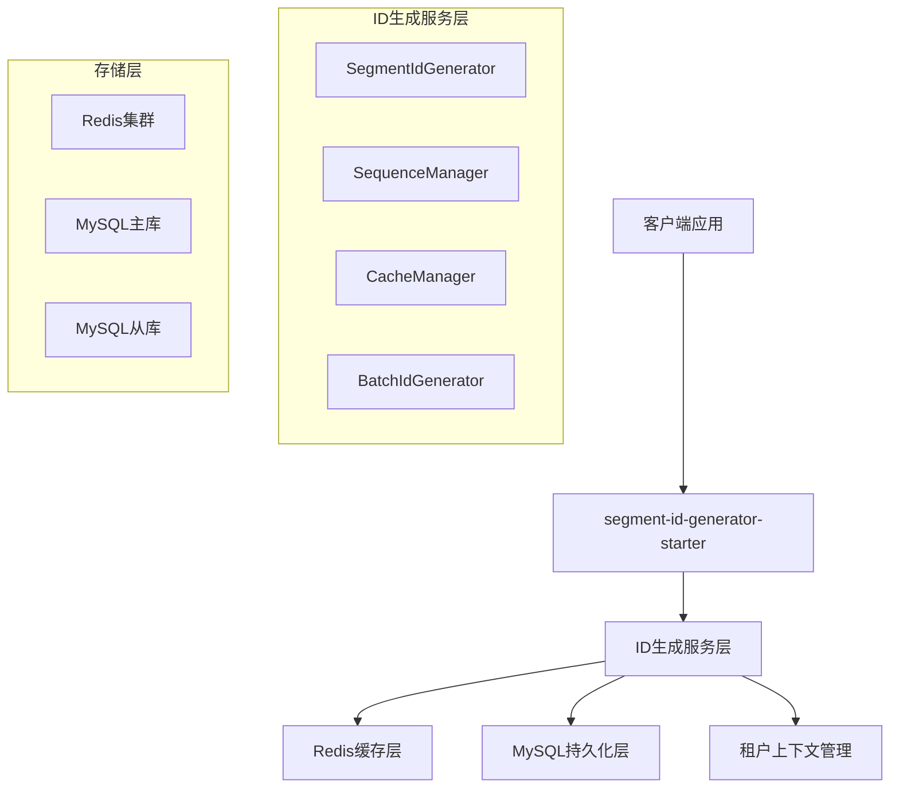
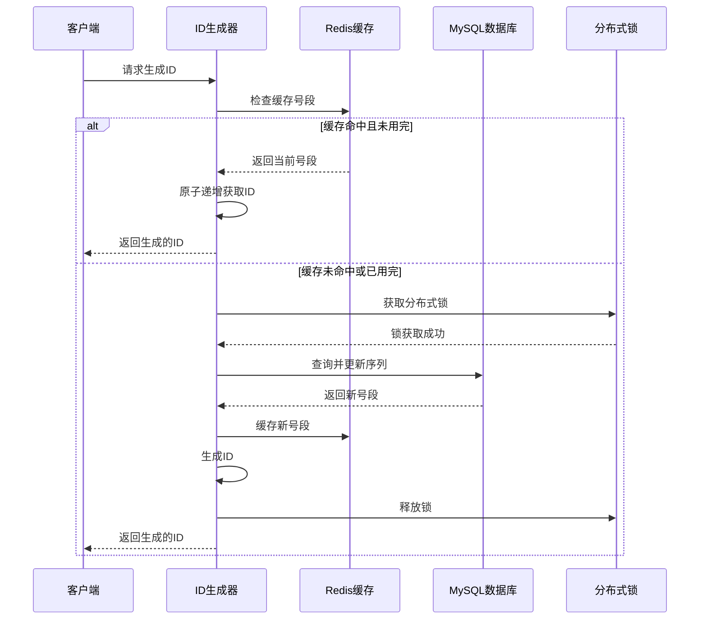

# 号段形式ID生成服务设计文档

## 概述

号段形式ID生成服务是一个高性能、高并发的分布式ID生成解决方案，采用号段预分配机制，通过Redis缓存和MySQL持久化相结合的方式，为多租户环境提供唯一、有序的ID生成服务。

## 架构设计

### 整体架构



### 核心设计原则

1. **高性能**: 通过Redis缓存减少数据库访问，支持批量ID生成
2. **高可用**: 主从数据库架构，Redis集群部署
3. **租户隔离**: 基于租户ID的完全数据隔离
4. **线程安全**: 使用分布式锁保证并发安全
5. **可扩展**: 支持多种ID生成类型和自定义格式

## 组件和接口

### 核心组件

#### 1. SegmentIdGenerator (ID生成器)
```java
@Component
public class SegmentIdGenerator {
    
    @Autowired
    private SequenceManager sequenceManager;
    
    @Autowired
    private RedissonClient redissonClient;
    
    @Autowired
    private SegmentIdProperties properties;
    
    /**
     * 生成单个ID
     * @param tenantId 租户ID
     * @param businessType 业务类型
     * @return 生成的ID
     */
    public String generateId(String tenantId, String businessType);
    
    /**
     * 批量生成ID
     * @param tenantId 租户ID
     * @param businessType 业务类型
     * @param count 生成数量
     * @return ID列表
     */
    public List<String> generateBatchIds(String tenantId, String businessType, int count);
    
    /**
     * 预热缓存
     * @param tenantId 租户ID
     * @param businessType 业务类型
     */
    public void preloadCache(String tenantId, String businessType);
    
    /**
     * 获取序列信息
     * @param tenantId 租户ID
     * @param businessType 业务类型
     * @return 序列信息
     */
    public SequenceInfo getSequenceInfo(String tenantId, String businessType);
}
```

#### 2. SequenceManager (序列管理器)
```java
@Service
@Transactional
public class SequenceManager {
    
    @Autowired
    private SequenceConfigRepository sequenceConfigRepository;
    
    @Autowired
    private SequenceStatisticsRepository sequenceStatisticsRepository;
    
    // 租户ID通过方法参数传入，由上层调用方处理
    
    /**
     * 获取下一个号段
     * @param tenantId 租户ID
     * @param businessType 业务类型
     * @return 号段信息
     */
    public SequenceSegment getNextSegment(String tenantId, String businessType);
    
    /**
     * 更新序列当前值
     * @param tenantId 租户ID
     * @param businessType 业务类型
     * @param currentValue 当前值
     */
    public void updateSequenceValue(String tenantId, String businessType, Long currentValue);
    
    /**
     * 初始化序列配置
     * @param tenantId 租户ID
     * @param config 序列配置
     */
    public void initSequenceConfig(String tenantId, SequenceConfig config);
    
    /**
     * 获取序列配置
     * @param tenantId 租户ID
     * @param businessType 业务类型
     * @return 序列配置
     */
    public SequenceConfig getSequenceConfig(String tenantId, String businessType);
    
    /**
     * 更新统计信息
     * @param tenantId 租户ID
     * @param businessType 业务类型
     * @param generateCount 生成数量
     * @param isBatch 是否批量生成
     */
    public void updateStatistics(String tenantId, String businessType, int generateCount, boolean isBatch);
}
```

#### 3. SegmentCacheManager (号段缓存管理器)
```java
@Service
public class SegmentCacheManager {
    
    @Autowired
    private RedissonClient redissonClient;
    
    @Autowired
    private SegmentIdProperties properties;
    
    // 租户ID通过方法参数传入，由上层调用方处理
    
    /**
     * 获取缓存中的号段
     * @param tenantId 租户ID
     * @param businessType 业务类型
     * @return 号段信息
     */
    public SequenceSegment getCachedSegment(String tenantId, String businessType);
    
    /**
     * 缓存号段
     * @param tenantId 租户ID
     * @param businessType 业务类型
     * @param segment 号段信息
     */
    public void cacheSegment(String tenantId, String businessType, SequenceSegment segment);
    
    /**
     * 清空指定租户缓存
     * @param tenantId 租户ID
     */
    public void clearTenantCache(String tenantId);
    
    /**
     * 清空所有缓存
     */
    public void clearAllCache();
    
    /**
     * 获取分布式锁
     * @param tenantId 租户ID
     * @param businessType 业务类型
     * @return 分布式锁
     */
    public RLock getDistributedLock(String tenantId, String businessType);
    
    /**
     * 构建缓存Key
     * @param tenantId 租户ID
     * @param businessType 业务类型
     * @return 缓存Key
     */
    private String buildCacheKey(String tenantId, String businessType);
}

### 对外接口

#### REST API接口
```java
@RestController
@RequestMapping("/api/v1/segment-id")
@Api(tags = "号段ID生成服务")
@Slf4j
public class SegmentIdController {
    
    @Autowired
    private SegmentIdGenerator segmentIdGenerator;
    
    @PostMapping("/generate")
    @ApiOperation("生成单个ID")
    public ResponseEntity<ApiResponse<String>> generateId(@RequestBody @Valid IdGenerateRequest request,
                                                         @RequestHeader(value = "X-Tenant-ID", required = false) String tenantId) {
        String id = segmentIdGenerator.generateId(tenantId, request.getBusinessType());
        return ResponseEntity.ok(ApiResponse.success(id));
    }
    
    @PostMapping("/generate/batch")
    @ApiOperation("批量生成ID")
    public ResponseEntity<ApiResponse<List<String>>> generateBatchIds(@RequestBody @Valid BatchIdGenerateRequest request,
                                                                     @RequestHeader(value = "X-Tenant-ID", required = false) String tenantId) {
        List<String> ids = segmentIdGenerator.generateBatchIds(tenantId, request.getBusinessType(), request.getCount());
        return ResponseEntity.ok(ApiResponse.success(ids));
    }
    
    @GetMapping("/sequence/{businessType}/info")
    @ApiOperation("获取序列信息")
    public ResponseEntity<ApiResponse<SequenceInfo>> getSequenceInfo(@PathVariable String businessType,
                                                                    @RequestHeader(value = "X-Tenant-ID", required = false) String tenantId) {
        SequenceInfo info = segmentIdGenerator.getSequenceInfo(tenantId, businessType);
        return ResponseEntity.ok(ApiResponse.success(info));
    }
    
    @PostMapping("/sequence/config")
    @ApiOperation("配置序列")
    public ResponseEntity<ApiResponse<Void>> configSequence(@RequestBody @Valid SequenceConfigRequest request,
                                                           @RequestHeader(value = "X-Tenant-ID", required = false) String tenantId) {
        sequenceManager.initSequenceConfig(tenantId, request.toEntity());
        return ResponseEntity.ok(ApiResponse.success());
    }
    
    @PostMapping("/cache/preload/{businessType}")
    @ApiOperation("预热缓存")
    public ResponseEntity<ApiResponse<Void>> preloadCache(@PathVariable String businessType,
                                                         @RequestHeader(value = "X-Tenant-ID", required = false) String tenantId) {
        segmentIdGenerator.preloadCache(tenantId, businessType);
        return ResponseEntity.ok(ApiResponse.success());
    }
    
    @DeleteMapping("/cache/clear")
    @ApiOperation("清空缓存")
    public ResponseEntity<ApiResponse<Void>> clearCache(@RequestParam(required = false) String tenantId) {
        if (tenantId != null) {
            segmentCacheManager.clearTenantCache(tenantId);
        } else {
            segmentCacheManager.clearAllCache();
        }
        return ResponseEntity.ok(ApiResponse.success());
    }
}
```

#### 序列配置管理接口
```java
@RestController
@RequestMapping("/api/v1/sequence-config")
@Api(tags = "序列配置管理")
@Slf4j
public class SequenceConfigController {
    
    @Autowired
    private SequenceManager sequenceManager;
    
    @PostMapping
    @ApiOperation("创建序列配置")
    public ResponseEntity<ApiResponse<Void>> createConfig(@RequestBody @Valid SequenceConfigRequest request);
    
    @PutMapping("/{businessType}")
    @ApiOperation("更新序列配置")
    public ResponseEntity<ApiResponse<Void>> updateConfig(@PathVariable String businessType, @RequestBody @Valid SequenceConfigRequest request);
    
    @GetMapping("/{businessType}")
    @ApiOperation("获取序列配置")
    public ResponseEntity<ApiResponse<SequenceConfigResponse>> getConfig(@PathVariable String businessType);
    
    @DeleteMapping("/{businessType}")
    @ApiOperation("删除序列配置")
    public ResponseEntity<ApiResponse<Void>> deleteConfig(@PathVariable String businessType);
    
    @GetMapping
    @ApiOperation("分页查询序列配置")
    public ResponseEntity<ApiResponse<PageResult<SequenceConfigResponse>>> listConfigs(@RequestParam(defaultValue = "1") int page, @RequestParam(defaultValue = "10") int size);
}
```

#### Starter自动配置接口
```java
@Configuration
@EnableConfigurationProperties(SegmentIdProperties.class)
@ConditionalOnProperty(prefix = "segment.id", name = "enabled", havingValue = "true", matchIfMissing = true)
@Import({SegmentIdRedissonConfig.class, SegmentIdDataSourceConfig.class})
@Slf4j
public class SegmentIdAutoConfiguration {
    
    @Bean
    @ConditionalOnMissingBean
    public SegmentIdGenerator segmentIdGenerator(SequenceManager sequenceManager, 
                                                SegmentCacheManager cacheManager,
                                                SegmentIdProperties properties) {
        return new SegmentIdGenerator(sequenceManager, cacheManager, properties);
    }
    
    @Bean
    @ConditionalOnMissingBean
    public SequenceManager sequenceManager(SequenceConfigRepository configRepository,
                                          SequenceStatisticsRepository statisticsRepository) {
        return new SequenceManager(configRepository, statisticsRepository);
    }
    
    @Bean
    @ConditionalOnMissingBean
    public SegmentCacheManager segmentCacheManager(RedissonClient redissonClient,
                                                  SegmentIdProperties properties) {
        return new SegmentCacheManager(redissonClient, properties);
    }
    
    @Bean
    @ConditionalOnMissingBean
    public SegmentIdTemplate segmentIdTemplate(SegmentIdGenerator generator) {
        return new SegmentIdTemplate(generator);
    }
    
    @PostConstruct
    public void init() {
        log.info("SegmentId Starter initialized successfully");
    }
}
```

#### 模板工具类
```java
@Component
public class SegmentIdTemplate {
    
    @Autowired
    private SegmentIdGenerator segmentIdGenerator;
    
    /**
     * 生成ID的便捷方法
     */
    public String nextId(String tenantId, String businessType) {
        return segmentIdGenerator.generateId(tenantId, businessType);
    }
    
    /**
     * 批量生成ID的便捷方法
     */
    public List<String> nextIds(String tenantId, String businessType, int count) {
        return segmentIdGenerator.generateBatchIds(tenantId, businessType, count);
    }
}
```

## 数据模型

### JPA实体类设计

#### SequenceConfig实体类
```java
@Entity
@Table(name = "sequence_config", 
       uniqueConstraints = @UniqueConstraint(columnNames = {"tenant_id", "business_type"}),
       indexes = {
           @Index(name = "idx_tenant_id", columnList = "tenant_id"),
           @Index(name = "idx_business_type", columnList = "business_type")
       })
@Data
@NoArgsConstructor
@AllArgsConstructor
public class SequenceConfig {
    
    @Id
    @GeneratedValue(strategy = GenerationType.IDENTITY)
    private Long id;
    
    @Column(name = "tenant_id", nullable = false, length = 64)
    private String tenantId;
    
    @Column(name = "business_type", nullable = false, length = 128)
    private String businessType;
    
    @Column(name = "table_name", nullable = false, length = 128)
    private String tableName;
    
    @Column(name = "service_name", nullable = false, length = 128)
    private String serviceName;
    
    @Column(name = "generation_type", nullable = false)
    private Integer generationType;
    
    @Column(name = "prefix", length = 32)
    private String prefix;
    
    @Column(name = "suffix", length = 32)
    private String suffix;
    
    @Column(name = "custom_template", length = 256)
    private String customTemplate;
    
    @Column(name = "id_length", nullable = false)
    private Integer idLength = 8;
    
    @Column(name = "seq_length", nullable = false)
    private Integer seqLength = 8;
    
    @Column(name = "step_size", nullable = false)
    private Integer stepSize = 1000;
    
    @Column(name = "current_value", nullable = false)
    private Long currentValue = 0L;
    
    @Column(name = "max_value", nullable = false)
    private Long maxValue = 99999999L;
    
    @Column(name = "cache_size", nullable = false)
    private Integer cacheSize = 1000;
    
    @Column(name = "status", nullable = false)
    private Integer status = 1;
    
    @CreationTimestamp
    @Column(name = "created_time")
    private LocalDateTime createdTime;
    
    @UpdateTimestamp
    @Column(name = "updated_time")
    private LocalDateTime updatedTime;
}
```

#### SequenceStatistics实体类
```java
@Entity
@Table(name = "sequence_statistics",
       uniqueConstraints = @UniqueConstraint(columnNames = {"tenant_id", "business_type", "date_key"}),
       indexes = {
           @Index(name = "idx_date_key", columnList = "date_key"),
           @Index(name = "idx_tenant_business", columnList = "tenant_id, business_type")
       })
@Data
@NoArgsConstructor
@AllArgsConstructor
public class SequenceStatistics {
    
    @Id
    @GeneratedValue(strategy = GenerationType.IDENTITY)
    private Long id;
    
    @Column(name = "tenant_id", nullable = false, length = 64)
    private String tenantId;
    
    @Column(name = "business_type", nullable = false, length = 128)
    private String businessType;
    
    @Column(name = "generate_count", nullable = false)
    private Long generateCount = 0L;
    
    @Column(name = "batch_generate_count", nullable = false)
    private Long batchGenerateCount = 0L;
    
    @Column(name = "total_generated", nullable = false)
    private Long totalGenerated = 0L;
    
    @Column(name = "last_generate_time")
    private LocalDateTime lastGenerateTime;
    
    @Column(name = "avg_response_time")
    private Double avgResponseTime;
    
    @Column(name = "date_key", nullable = false)
    private LocalDate dateKey;
    
    @CreationTimestamp
    @Column(name = "created_time")
    private LocalDateTime createdTime;
    
    @UpdateTimestamp
    @Column(name = "updated_time")
    private LocalDateTime updatedTime;
}
```

### JPA Repository接口

#### SequenceConfigRepository
```java
@Repository
public interface SequenceConfigRepository extends JpaRepository<SequenceConfig, Long> {
    
    /**
     * 根据租户ID和业务类型查询配置
     */
    Optional<SequenceConfig> findByTenantIdAndBusinessType(String tenantId, String businessType);
    
    /**
     * 根据租户ID查询所有配置
     */
    List<SequenceConfig> findByTenantId(String tenantId);
    
    /**
     * 根据租户ID和状态查询配置
     */
    List<SequenceConfig> findByTenantIdAndStatus(String tenantId, Integer status);
    
    /**
     * 分页查询租户配置
     */
    Page<SequenceConfig> findByTenantId(String tenantId, Pageable pageable);
    
    /**
     * 原子性更新当前值
     */
    @Modifying
    @Query("UPDATE SequenceConfig s SET s.currentValue = s.currentValue + :stepSize, s.updatedTime = CURRENT_TIMESTAMP WHERE s.tenantId = :tenantId AND s.businessType = :businessType")
    int updateCurrentValue(@Param("tenantId") String tenantId, 
                          @Param("businessType") String businessType, 
                          @Param("stepSize") Long stepSize);
    
    /**
     * 检查序列是否存在
     */
    boolean existsByTenantIdAndBusinessType(String tenantId, String businessType);
    
    /**
     * 删除租户配置
     */
    void deleteByTenantIdAndBusinessType(String tenantId, String businessType);
}
```

#### SequenceStatisticsRepository
```java
@Repository
public interface SequenceStatisticsRepository extends JpaRepository<SequenceStatistics, Long> {
    
    /**
     * 根据租户ID、业务类型和日期查询统计
     */
    Optional<SequenceStatistics> findByTenantIdAndBusinessTypeAndDateKey(String tenantId, String businessType, LocalDate dateKey);
    
    /**
     * 根据租户ID和日期范围查询统计
     */
    List<SequenceStatistics> findByTenantIdAndDateKeyBetween(String tenantId, LocalDate startDate, LocalDate endDate);
    
    /**
     * 根据业务类型和日期范围查询统计
     */
    List<SequenceStatistics> findByTenantIdAndBusinessTypeAndDateKeyBetween(String tenantId, String businessType, LocalDate startDate, LocalDate endDate);
    
    /**
     * 更新统计信息
     */
    @Modifying
    @Query("UPDATE SequenceStatistics s SET s.generateCount = s.generateCount + :generateCount, " +
           "s.batchGenerateCount = s.batchGenerateCount + :batchCount, " +
           "s.totalGenerated = s.totalGenerated + :totalCount, " +
           "s.lastGenerateTime = :lastTime, " +
           "s.updatedTime = CURRENT_TIMESTAMP " +
           "WHERE s.tenantId = :tenantId AND s.businessType = :businessType AND s.dateKey = :dateKey")
    int updateStatistics(@Param("tenantId") String tenantId,
                        @Param("businessType") String businessType,
                        @Param("dateKey") LocalDate dateKey,
                        @Param("generateCount") Long generateCount,
                        @Param("batchCount") Long batchCount,
                        @Param("totalCount") Long totalCount,
                        @Param("lastTime") LocalDateTime lastTime);
    
    /**
     * 删除过期统计数据
     */
    @Modifying
    @Query("DELETE FROM SequenceStatistics s WHERE s.dateKey < :expireDate")
    int deleteExpiredStatistics(@Param("expireDate") LocalDate expireDate);
}
```

### 数据库表DDL
```sql
CREATE TABLE sequence_config (
    id BIGINT PRIMARY KEY AUTO_INCREMENT,
    tenant_id VARCHAR(64) NOT NULL COMMENT '租户ID',
    business_type VARCHAR(128) NOT NULL COMMENT '业务类型',
    table_name VARCHAR(128) NOT NULL COMMENT '表名',
    service_name VARCHAR(128) NOT NULL COMMENT '服务名',
    generation_type INT NOT NULL COMMENT '生成类型: 1-纯数字, 2-前缀+数字, 3-数字+后缀, 4-自定义',
    prefix VARCHAR(32) DEFAULT NULL COMMENT '前缀',
    suffix VARCHAR(32) DEFAULT NULL COMMENT '后缀',
    custom_template VARCHAR(256) DEFAULT NULL COMMENT '自定义模板',
    id_length INT NOT NULL DEFAULT 8 COMMENT 'ID总长度',
    seq_length INT NOT NULL DEFAULT 8 COMMENT '序号长度',
    step_size INT NOT NULL DEFAULT 1000 COMMENT '步进大小',
    current_value BIGINT NOT NULL DEFAULT 0 COMMENT '当前值',
    max_value BIGINT NOT NULL DEFAULT 99999999 COMMENT '最大值',
    cache_size INT NOT NULL DEFAULT 1000 COMMENT '缓存大小',
    status INT NOT NULL DEFAULT 1 COMMENT '状态: 1-启用, 0-禁用',
    created_time TIMESTAMP DEFAULT CURRENT_TIMESTAMP,
    updated_time TIMESTAMP DEFAULT CURRENT_TIMESTAMP ON UPDATE CURRENT_TIMESTAMP,
    UNIQUE KEY uk_tenant_business (tenant_id, business_type),
    INDEX idx_tenant_id (tenant_id),
    INDEX idx_business_type (business_type)
) ENGINE=InnoDB DEFAULT CHARSET=utf8mb4 COMMENT='序列配置表';

CREATE TABLE sequence_statistics (
    id BIGINT PRIMARY KEY AUTO_INCREMENT,
    tenant_id VARCHAR(64) NOT NULL,
    business_type VARCHAR(128) NOT NULL,
    generate_count BIGINT NOT NULL DEFAULT 0 COMMENT '生成次数',
    batch_generate_count BIGINT NOT NULL DEFAULT 0 COMMENT '批量生成次数',
    total_generated BIGINT NOT NULL DEFAULT 0 COMMENT '总生成数量',
    last_generate_time TIMESTAMP NULL COMMENT '最后生成时间',
    avg_response_time DOUBLE DEFAULT NULL COMMENT '平均响应时间',
    date_key DATE NOT NULL COMMENT '统计日期',
    created_time TIMESTAMP DEFAULT CURRENT_TIMESTAMP,
    updated_time TIMESTAMP DEFAULT CURRENT_TIMESTAMP ON UPDATE CURRENT_TIMESTAMP,
    UNIQUE KEY uk_tenant_business_date (tenant_id, business_type, date_key),
    INDEX idx_date_key (date_key),
    INDEX idx_tenant_business (tenant_id, business_type)
) ENGINE=InnoDB DEFAULT CHARSET=utf8mb4 COMMENT='序列使用统计表';
```

### Redis缓存结构

#### Redisson配置
```yaml
# application.yml中的配置
segment:
  id:
    enabled: true
    redis:
      host: localhost
      port: 6379
      password: # 可选
      database: 1
      pool:
        max-active: 64
        max-idle: 24
        min-idle: 8
        connection-timeout: 10000
        timeout: 3000
    cache:
      key-prefix: "segment-id"
      segment-ttl: 3600  # 号段缓存1小时
      lock-ttl: 30       # 分布式锁30秒
      stats-ttl: 86400   # 统计缓存1天
```

#### 缓存Key设计
```
# 号段缓存 Key格式: segment-id:segment:{tenantId}:{businessType}
{
    "currentValue": 1000,
    "maxValue": 2000,
    "step": 1000,
    "generationType": 1,
    "prefix": "ORDER",
    "suffix": "",
    "idLength": 8,
    "customTemplate": null,
    "seqLength": 8,
    "tenantId": "tenant001",
    "businessType": "ORDER_ID",
    "lastUpdateTime": "2025-01-25T10:30:00"
}

# 分布式锁 Key格式: segment-id:lock:{tenantId}:{businessType}
# TTL: 30秒，使用Redisson的RLock

# 统计缓存 Key格式: segment-id:stats:{tenantId}:{businessType}:{date}
{
    "generateCount": 1500,
    "batchGenerateCount": 10,
    "lastGenerateTime": "2025-01-25T10:30:00",
    "totalGenerated": 15000,
    "avgResponseTime": 5.2
}

# 序列配置缓存 Key格式: segment-id:config:{tenantId}:{businessType}
# 缓存序列配置信息，减少数据库查询
```

#### Redisson客户端配置类
```java
@Configuration
@ConditionalOnProperty(prefix = "segment.id", name = "enabled", havingValue = "true")
public class SegmentIdRedissonConfig {
    
    @Autowired
    private SegmentIdProperties properties;
    
    @Bean(name = "segmentIdRedissonClient")
    @ConditionalOnMissingBean(name = "segmentIdRedissonClient")
    public RedissonClient segmentIdRedissonClient() {
        Config config = new Config();
        
        SegmentIdProperties.RedisConfig redisConfig = properties.getRedis();
        String address = "redis://" + redisConfig.getHost() + ":" + redisConfig.getPort();
        
        if (StringUtils.hasText(redisConfig.getPassword())) {
            config.useSingleServer()
                .setAddress(address)
                .setPassword(redisConfig.getPassword())
                .setDatabase(redisConfig.getDatabase())
                .setConnectionMinimumIdleSize(redisConfig.getPool().getMinIdle())
                .setConnectionPoolSize(redisConfig.getPool().getMaxActive())
                .setConnectTimeout(redisConfig.getPool().getConnectionTimeout())
                .setTimeout(redisConfig.getPool().getTimeout());
        } else {
            config.useSingleServer()
                .setAddress(address)
                .setDatabase(redisConfig.getDatabase())
                .setConnectionMinimumIdleSize(redisConfig.getPool().getMinIdle())
                .setConnectionPoolSize(redisConfig.getPool().getMaxActive())
                .setConnectTimeout(redisConfig.getPool().getConnectionTimeout())
                .setTimeout(redisConfig.getPool().getTimeout());
        }
        
        return Redisson.create(config);
    }
}
```

## ID生成算法

### 生成类型实现

#### 类型1: 纯数字ID
```java
public String generateNumericId(SequenceSegment segment, long currentValue) {
    String numStr = String.valueOf(currentValue);
    return String.format("%0" + segment.getIdLength() + "d", Long.parseLong(numStr));
}
```

#### 类型2: 前缀+数字ID
```java
public String generatePrefixId(SequenceSegment segment, long currentValue) {
    String numStr = String.format("%0" + (segment.getIdLength() - segment.getPrefix().length()) + "d", currentValue);
    return segment.getPrefix() + numStr;
}
```

#### 类型3: 数字+后缀ID
```java
public String generateSuffixId(SequenceSegment segment, long currentValue) {
    String numStr = String.format("%0" + (segment.getIdLength() - segment.getSuffix().length()) + "d", currentValue);
    return numStr + segment.getSuffix();
}
```

#### 类型4: 自定义格式ID
```java
public String generateCustomId(SequenceSegment segment, long currentValue) {
    // 支持占位符: {seq}, {date}, {tenant}等
    String template = segment.getCustomTemplate();
    return template.replace("{seq}", String.format("%0" + segment.getSeqLength() + "d", currentValue))
                  .replace("{date}", DateUtil.format(new Date(), "yyyyMMdd"))
                  .replace("{tenant}", segment.getTenantId().substring(0, 2));
}
```

### 号段获取流程



## 错误处理

### 异常类型定义
```java
public class SegmentIdException extends RuntimeException {
    public static class SequenceExhaustedException extends SegmentIdException {}
    public static class SequenceNotConfiguredException extends SegmentIdException {}
    public static class CacheUnavailableException extends SegmentIdException {}
    public static class DatabaseUnavailableException extends SegmentIdException {}
    public static class TenantNotAuthorizedException extends SegmentIdException {}
}
```

### 错误处理策略
1. **序列耗尽**: 抛出异常，记录告警日志，通知管理员扩容
2. **缓存不可用**: 降级到数据库直接生成，性能告警
3. **数据库不可用**: 使用本地缓存应急，限制生成数量
4. **租户未授权**: 返回权限错误，记录安全日志
5. **并发冲突**: 自动重试，超过重试次数后抛出异常

## 测试策略

### 单元测试
- ID生成算法正确性测试
- 缓存操作测试
- 数据库操作测试
- 异常处理测试

### 集成测试
- Redis集群连接测试
- MySQL主从切换测试
- 租户隔离测试
- 分布式锁测试

### 性能测试
- 单线程生成性能测试 (目标: >10000 QPS)
- 多线程并发测试 (目标: >50000 QPS)
- 批量生成性能测试 (目标: 10万ID/秒)
- 缓存命中率测试 (目标: >95%)

### 压力测试
- 长时间运行稳定性测试
- 内存泄漏测试
- 数据库连接池测试
- Redis连接池测试

## 监控和运维

### 关键指标监控
- ID生成QPS和响应时间
- 缓存命中率和Redis连接状态
- 数据库连接池状态和慢查询
- 序列使用率和剩余容量
- 错误率和异常统计

### 告警规则
- 序列使用率超过80%告警
- ID生成失败率超过1%告警
- 缓存命中率低于90%告警
- 响应时间超过100ms告警
- Redis或MySQL连接异常告警

### 运维工具
- 序列配置管理接口
- 自定义监控数据查询接口
- 性能分析工具
- 故障诊断接口
- 数据备份恢复脚本

注意：移除了Spring Boot Actuator依赖，使用自定义监控接口
## 
配置文件详细说明

### application.yml完整配置示例
```yaml
# 号段ID生成服务配置
segment:
  id:
    enabled: true
    # Redis配置
    redis:
      host: localhost
      port: 6379
      password: # 可选
      database: 1
      pool:
        max-active: 64
        max-idle: 24
        min-idle: 8
        connection-timeout: 10000
        timeout: 3000
    # JPA数据源配置 - 使用tenant_center默认库
    datasource:
      driver-class-name: com.mysql.cj.jdbc.Driver
      url: jdbc:mysql://localhost:3306/tenant_center?useUnicode=true&characterEncoding=UTF-8&serverTimezone=UTC
      username: root
      password: password
      type: com.alibaba.druid.pool.DruidDataSource
      # Druid连接池配置
      druid:
        initial-size: 5
        min-idle: 5
        max-active: 20
        max-wait: 60000
        time-between-eviction-runs-millis: 60000
        min-evictable-idle-time-millis: 300000
        validation-query: SELECT 1
        test-while-idle: true
        test-on-borrow: false
        test-on-return: false
    # JPA配置
    jpa:
      hibernate:
        ddl-auto: none
        naming:
          physical-strategy: org.hibernate.boot.model.naming.PhysicalNamingStrategyStandardImpl
      show-sql: true
      properties:
        hibernate:
          format_sql: true
          dialect: org.hibernate.dialect.MySQL57Dialect
          jdbc:
            batch_size: 50
          order_inserts: true
          order_updates: true
      open-in-view: false
    # 缓存配置
    cache:
      key-prefix: "segment-id"
      segment-ttl: 3600      # 号段缓存1小时
      lock-ttl: 30           # 分布式锁30秒
      stats-ttl: 86400       # 统计缓存1天
      preload-enabled: true  # 启用预加载
      preload-business-types: ["ORDER_ID", "USER_ID", "PRODUCT_ID"]
    # 性能配置
    performance:
      default-step-size: 1000        # 默认步进大小
      max-batch-size: 10000          # 最大批量生成数量
      cache-refresh-threshold: 0.2   # 缓存刷新阈值（剩余20%时刷新）
      max-retry-times: 3             # 最大重试次数
      retry-interval: 100            # 重试间隔（毫秒）
    # 监控配置
    monitoring:
      enabled: true
      metrics-enabled: true
      health-check-enabled: true
      slow-query-threshold: 1000     # 慢查询阈值（毫秒）
    # 安全配置
    security:
      tenant-isolation-enabled: true
      api-rate-limit: 10000          # API限流（每分钟）
      sequence-usage-alert: 0.8      # 序列使用率告警阈值

# 注意：租户处理由上层调用方负责，此处不需要租户路由配置

# 日志配置
logging:
  level:
    com.segment.id: DEBUG
    org.redisson: INFO
  pattern:
    console: "%d{yyyy-MM-dd HH:mm:ss.SSS} [%thread] %-5level [%X{tenantId:-}] %logger{36} - %msg%n"
```

### 生产环境配置优化
```yaml
# application-prod.yml
segment:
  id:
    redis:
      # 生产环境Redis集群配置
      cluster:
        nodes: 
          - redis-node1:6379
          - redis-node2:6379
          - redis-node3:6379
        password: ${REDIS_PASSWORD}
        max-redirects: 3
      pool:
        max-active: 128
        max-idle: 64
        min-idle: 16
    datasource:
      # 生产环境数据库配置
      url: jdbc:mysql://mysql-master:3306,mysql-slave:3306/tenant_center?useUnicode=true&characterEncoding=UTF-8&serverTimezone=UTC&useSSL=true
      username: ${DB_USERNAME}
      password: ${DB_PASSWORD}
      type: com.alibaba.druid.pool.DruidDataSource
      druid:
        initial-size: 10
        min-idle: 10
        max-active: 50
        max-wait: 30000
        # 启用监控
        stat-view-servlet:
          enabled: true
          url-pattern: /druid/*
          login-username: ${DRUID_USERNAME}
          login-password: ${DRUID_PASSWORD}
        web-stat-filter:
          enabled: true
          url-pattern: /*
          exclusions: '*.js,*.gif,*.jpg,*.png,*.css,*.ico,/druid/*'
    # 生产环境JPA配置
    jpa:
      hibernate:
        ddl-auto: validate
      show-sql: false
      properties:
        hibernate:
          format_sql: false
          dialect: org.hibernate.dialect.MySQL57Dialect
          jdbc:
            batch_size: 100
          order_inserts: true
          order_updates: true
          cache:
            use_second_level_cache: true
            use_query_cache: true
      open-in-view: false
    performance:
      default-step-size: 3000
      max-batch-size: 50000
      cache-refresh-threshold: 0.1
    monitoring:
      # 生产环境监控配置
      prometheus:
        enabled: true
        endpoint: /actuator/prometheus
      alerting:
        enabled: true
        webhook-url: ${ALERT_WEBHOOK_URL}

# 日志配置
logging:
  level:
    root: INFO
    com.segment.id: INFO
  config: classpath:logback-spring.xml
```

## 部署架构建议

### 高可用部署架构
```
┌─────────────────┐    ┌─────────────────┐    ┌─────────────────┐
│   应用服务器1    │    │   应用服务器2    │    │   应用服务器3    │
│                │    │                │    │                │
│ segment-id     │    │ segment-id     │    │ segment-id     │
│ generator      │    │ generator      │    │ generator      │
└─────────────────┘    └─────────────────┘    └─────────────────┘
         │                       │                       │
         └───────────────────────┼───────────────────────┘
                                 │
         ┌───────────────────────┼───────────────────────┐
         │                       │                       │
┌─────────────────┐    ┌─────────────────┐    ┌─────────────────┐
│   Redis Node1   │    │   Redis Node2   │    │   Redis Node3   │
│   (Master)      │    │   (Slave)       │    │   (Slave)       │
└─────────────────┘    └─────────────────┘    └─────────────────┘
                                 │
         ┌───────────────────────┼───────────────────────┐
         │                       │                       │
┌─────────────────┐    ┌─────────────────┐    ┌─────────────────┐
│  MySQL Master  │    │  MySQL Slave1   │    │  MySQL Slave2   │
│                │────│                │────│                │
│ (Read/Write)   │    │ (Read Only)     │    │ (Read Only)     │
└─────────────────┘    └─────────────────┘    └─────────────────┘
```

### 容量规划建议
- **QPS目标**: 单实例5万+，集群15万+
- **Redis内存**: 每个租户每个业务类型约1KB，2000租户×100业务类型=200MB
- **数据库存储**: sequence_config表约10MB，statistics表按日分区
- **应用内存**: JVM堆内存建议4GB，包含连接池和缓存
- **网络带宽**: 每个请求约1KB，5万QPS需要50MB/s带宽

### 监控指标建议
- **业务指标**: ID生成QPS、批量生成QPS、序列使用率
- **技术指标**: 缓存命中率、数据库连接数、响应时间
- **错误指标**: 异常率、超时率、序列耗尽次数
- **资源指标**: CPU使用率、内存使用率、网络IO