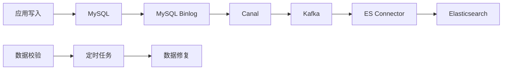

# Elasticsearch索引设计详细方案

## 1. 索引设计原则

### 1.1 设计理念
- **读写分离**: 写入优化的索引 vs 查询优化的索引
- **冷热分离**: 按时间维度分层存储
- **租户隔离**: 支持多租户数据隔离
- **性能优先**: 针对高频查询场景优化

### 1.2 命名规范
```
索引命名格式: {业务域}_{数据类型}_{时间维度}_{版本}
示例:
- testmgmt_cases_2024_v1
- testmgmt_executions_202401_v1  
- testmgmt_bugs_hot_v1
- testmgmt_reports_agg_v1
```

## 2. 核心业务索引设计

### 2.1 测试用例索引 (testmgmt_cases_*)

#### 索引模板配置
```json
{
  "index_patterns": ["testmgmt_cases_*"],
  "template": {
    "settings": {
      "number_of_shards": 12,
      "number_of_replicas": 1,
      "refresh_interval": "30s",
      "index.lifecycle.name": "testmgmt_cases_policy",
      "index.routing.allocation.total_shards_per_node": 2,
      "analysis": {
        "analyzer": {
          "case_analyzer": {
            "type": "custom",
            "tokenizer": "ik_max_word",
            "filter": ["lowercase", "stop"]
          }
        }
      }
    },
    "mappings": {
      "properties": {
        "case_id": {
          "type": "keyword",
          "doc_values": true
        },
        "tenant_id": {
          "type": "keyword",
          "doc_values": true
        },
        "repo_id": {
          "type": "keyword"
        },
        "repo_version_id": {
          "type": "keyword"
        },
        "folder_id": {
          "type": "keyword"
        },
        "name": {
          "type": "text",
          "analyzer": "case_analyzer",
          "fields": {
            "keyword": {
              "type": "keyword",
              "ignore_above": 256
            }
          }
        },
        "description": {
          "type": "text",
          "analyzer": "case_analyzer"
        },
        "priority": {
          "type": "keyword"
        },
        "status": {
          "type": "keyword"
        },
        "type": {
          "type": "keyword"
        },
        "review_state": {
          "type": "keyword"
        },
        "automated_state": {
          "type": "keyword"
        },
        "created_by": {
          "type": "keyword"
        },
        "created_at": {
          "type": "date",
          "format": "yyyy-MM-dd HH:mm:ss||yyyy-MM-dd||epoch_millis"
        },
        "updated_at": {
          "type": "date",
          "format": "yyyy-MM-dd HH:mm:ss||yyyy-MM-dd||epoch_millis"
        },
        "tags": {
          "type": "keyword"
        },
        "module": {
          "type": "keyword"
        },
        "version": {
          "type": "keyword"
        },
        "bug_count": {
          "type": "integer"
        },
        "run_times": {
          "type": "integer"
        },
        "steps": {
          "type": "nested",
          "properties": {
            "step_id": {"type": "keyword"},
            "content": {"type": "text", "analyzer": "case_analyzer"},
            "expected_result": {"type": "text", "analyzer": "case_analyzer"}
          }
        }
      }
    }
  }
}
```

#### 查询优化策略
```json
{
  "常用查询1": "按租户+状态查询",
  "query": {
    "bool": {
      "filter": [
        {"term": {"tenant_id": "tenant_001"}},
        {"term": {"status": "active"}}
      ]
    }
  },
  "优化": "tenant_id和status建立复合索引"
}
```

### 2.2 测试执行索引 (testmgmt_executions_*)

#### 按月分片策略
```json
{
  "index_patterns": ["testmgmt_executions_*"],
  "template": {
    "settings": {
      "number_of_shards": 24,
      "number_of_replicas": 1,
      "refresh_interval": "5s",
      "index.lifecycle.name": "testmgmt_executions_policy"
    },
    "mappings": {
      "properties": {
        "execution_id": {
          "type": "keyword"
        },
        "case_id": {
          "type": "keyword"
        },
        "plan_id": {
          "type": "keyword"
        },
        "tenant_id": {
          "type": "keyword"
        },
        "executor": {
          "type": "keyword"
        },
        "result": {
          "type": "keyword"
        },
        "execution_time": {
          "type": "date"
        },
        "duration": {
          "type": "integer"
        },
        "environment": {
          "type": "keyword"
        },
        "version": {
          "type": "keyword"
        },
        "iteration": {
          "type": "keyword"
        },
        "error_message": {
          "type": "text",
          "analyzer": "standard"
        },
        "screenshots": {
          "type": "keyword",
          "index": false
        },
        "logs": {
          "type": "text",
          "index": false
        }
      }
    }
  }
}
```

### 2.3 缺陷管理索引 (testmgmt_bugs_*)

```json
{
  "index_patterns": ["testmgmt_bugs_*"],
  "template": {
    "settings": {
      "number_of_shards": 8,
      "number_of_replicas": 1,
      "refresh_interval": "10s"
    },
    "mappings": {
      "properties": {
        "bug_id": {
          "type": "keyword"
        },
        "tenant_id": {
          "type": "keyword"
        },
        "project_id": {
          "type": "keyword"
        },
        "title": {
          "type": "text",
          "analyzer": "ik_max_word",
          "fields": {
            "keyword": {
              "type": "keyword",
              "ignore_above": 256
            }
          }
        },
        "description": {
          "type": "text",
          "analyzer": "ik_max_word"
        },
        "severity": {
          "type": "keyword"
        },
        "priority": {
          "type": "keyword"
        },
        "status": {
          "type": "keyword"
        },
        "assignee": {
          "type": "keyword"
        },
        "reporter": {
          "type": "keyword"
        },
        "created_at": {
          "type": "date"
        },
        "updated_at": {
          "type": "date"
        },
        "resolved_at": {
          "type": "date"
        },
        "module": {
          "type": "keyword"
        },
        "version": {
          "type": "keyword"
        },
        "related_cases": {
          "type": "keyword"
        },
        "changes": {
          "type": "nested",
          "properties": {
            "change_time": {"type": "date"},
            "change_type": {"type": "keyword"},
            "change_by": {"type": "keyword"},
            "old_value": {"type": "text"},
            "new_value": {"type": "text"}
          }
        }
      }
    }
  }
}
```

### 2.4 报表聚合索引 (testmgmt_reports_agg_*)

```json
{
  "index_patterns": ["testmgmt_reports_agg_*"],
  "template": {
    "settings": {
      "number_of_shards": 4,
      "number_of_replicas": 1,
      "refresh_interval": "60s"
    },
    "mappings": {
      "properties": {
        "tenant_id": {
          "type": "keyword"
        },
        "report_date": {
          "type": "date",
          "format": "yyyy-MM-dd"
        },
        "report_type": {
          "type": "keyword"
        },
        "metrics": {
          "type": "object",
          "properties": {
            "total_cases": {"type": "integer"},
            "executed_cases": {"type": "integer"},
            "passed_cases": {"type": "integer"},
            "failed_cases": {"type": "integer"},
            "blocked_cases": {"type": "integer"},
            "pass_rate": {"type": "float"},
            "total_bugs": {"type": "integer"},
            "open_bugs": {"type": "integer"},
            "resolved_bugs": {"type": "integer"},
            "bug_density": {"type": "float"}
          }
        },
        "dimensions": {
          "type": "object",
          "properties": {
            "project": {"type": "keyword"},
            "version": {"type": "keyword"},
            "module": {"type": "keyword"},
            "iteration": {"type": "keyword"},
            "environment": {"type": "keyword"}
          }
        }
      }
    }
  }
}
```

## 3. 索引生命周期管理

### 3.1 热温冷数据策略

```json
{
  "testmgmt_cases_policy": {
    "policy": {
      "phases": {
        "hot": {
          "actions": {
            "rollover": {
              "max_size": "10GB",
              "max_age": "30d",
              "max_docs": 10000000
            },
            "set_priority": {
              "priority": 100
            }
          }
        },
        "warm": {
          "min_age": "30d",
          "actions": {
            "allocate": {
              "number_of_replicas": 0
            },
            "forcemerge": {
              "max_num_segments": 1
            },
            "set_priority": {
              "priority": 50
            }
          }
        },
        "cold": {
          "min_age": "90d",
          "actions": {
            "allocate": {
              "number_of_replicas": 0,
              "include": {
                "box_type": "cold"
              }
            },
            "set_priority": {
              "priority": 0
            }
          }
        },
        "delete": {
          "min_age": "2y"
        }
      }
    }
  }
}
```

### 3.2 执行数据快速轮转策略

```json
{
  "testmgmt_executions_policy": {
    "policy": {
      "phases": {
        "hot": {
          "actions": {
            "rollover": {
              "max_size": "5GB",
              "max_age": "7d"
            }
          }
        },
        "warm": {
          "min_age": "7d",
          "actions": {
            "allocate": {
              "number_of_replicas": 0
            },
            "forcemerge": {
              "max_num_segments": 1
            }
          }
        },
        "cold": {
          "min_age": "30d",
          "actions": {
            "allocate": {
              "number_of_replicas": 0
            }
          }
        },
        "delete": {
          "min_age": "1y"
        }
      }
    }
  }
}
```

## 4. 查询优化策略

### 4.1 常用查询模式

#### 用例查询优化
```json
{
  "用例列表查询": {
    "query": {
      "bool": {
        "filter": [
          {"term": {"tenant_id": "tenant_001"}},
          {"term": {"repo_id": "repo_123"}},
          {"range": {"created_at": {"gte": "2024-01-01"}}}
        ]
      }
    },
    "sort": [
      {"created_at": {"order": "desc"}}
    ],
    "from": 0,
    "size": 20
  }
}
```

#### 执行统计查询
```json
{
  "执行统计聚合": {
    "query": {
      "bool": {
        "filter": [
          {"term": {"tenant_id": "tenant_001"}},
          {"range": {"execution_time": {"gte": "2024-01-01", "lte": "2024-01-31"}}}
        ]
      }
    },
    "aggs": {
      "by_result": {
        "terms": {
          "field": "result"
        }
      },
      "by_day": {
        "date_histogram": {
          "field": "execution_time",
          "calendar_interval": "day"
        },
        "aggs": {
          "pass_rate": {
            "bucket_script": {
              "buckets_path": {
                "passed": "by_result['passed']>_count",
                "total": "_count"
              },
              "script": "params.passed / params.total * 100"
            }
          }
        }
      }
    }
  }
}
```

### 4.2 性能优化建议

#### 分片策略
```
数据量级别     | 建议分片数 | 单分片大小
-------------|-----------|----------
< 1000万     | 3-6       | < 30GB
1000万-1亿   | 6-12      | 20-50GB  
1亿-10亿     | 12-24     | 30-50GB
> 10亿       | 24+       | 30-50GB
```

#### 查询缓存策略
```json
{
  "查询缓存配置": {
    "index.queries.cache.enabled": true,
    "index.requests.cache.enable": true,
    "indices.queries.cache.size": "20%",
    "indices.requests.cache.size": "2%"
  }
}
```

## 5. 监控和运维

### 5.1 关键指标监控

```json
{
  "性能指标": {
    "查询QPS": "indices.search.query_total",
    "查询延迟": "indices.search.query_time_in_millis", 
    "索引速度": "indices.indexing.index_total",
    "存储使用": "indices.store.size_in_bytes"
  },
  "集群健康": {
    "集群状态": "cluster.health.status",
    "节点数量": "cluster.health.number_of_nodes",
    "分片状态": "cluster.health.active_shards"
  }
}
```

### 5.2 告警规则

```yaml
alerts:
  - name: es_cluster_health
    condition: cluster.health.status != "green"
    duration: 5m
    
  - name: es_query_latency
    condition: avg(indices.search.query_time_in_millis) > 1000
    duration: 2m
    
  - name: es_disk_usage
    condition: disk.usage.percent > 85
    duration: 1m
```

## 6. 数据同步策略

### 6.1 实时同步架构



### 6.2 同步配置示例

```yaml
canal_config:
  destinations:
    - name: test_cases
      mysql:
        database: testmgmt
        table: test_cases
      elasticsearch:
        index: testmgmt_cases_2024_v1
        type: _doc
      transform:
        - field: created_at
          type: date
          format: "yyyy-MM-dd HH:mm:ss"
```

## 7. 容量规划

### 7.1 存储容量估算

```
业务数据量估算:
- 测试用例: 4000万/年 × 2KB = 80GB/年
- 执行记录: 6000万/年 × 1KB = 60GB/年  
- 缺陷数据: 2000万/年 × 3KB = 60GB/年
- 报表数据: 聚合后约10GB/年

ES存储(含副本):
- 原始数据: 210GB/年 × 2 = 420GB/年
- 索引开销: 420GB × 0.3 = 126GB/年
- 总计: 546GB/年

建议配置: 3年数据 × 546GB = 1.6TB
推荐集群: 12节点 × 500GB SSD = 6TB
```

### 7.2 性能容量规划

```
QPS规划:
- 查询QPS: 10000/s (峰值)
- 写入QPS: 5000/s (峰值)
- 聚合查询: 100/s

硬件配置建议:
- CPU: 16核+ (查询密集)
- 内存: 64GB+ (JVM堆内存32GB)
- 存储: SSD (IOPS > 10000)
- 网络: 万兆网卡
```

## 8. 最佳实践总结

### 8.1 索引设计原则
1. **合理分片**: 避免过度分片和分片过大
2. **字段优化**: 不需要搜索的字段设置index=false
3. **映射优化**: 合理使用keyword vs text
4. **生命周期**: 配置ILM自动管理索引

### 8.2 查询优化技巧
1. **使用filter**: 优先使用filter context
2. **避免深分页**: 使用scroll或search_after
3. **合理聚合**: 控制聚合的基数和层级
4. **缓存利用**: 充分利用查询缓存

### 8.3 运维建议
1. **监控完善**: 建立完整的监控体系
2. **备份策略**: 定期快照备份
3. **版本管理**: 索引版本化管理
4. **容量规划**: 提前进行容量规划

这个ES索引设计方案能够很好地支持您的测试管理系统，在保证查询性能的同时，也考虑了数据的生命周期管理和运维便利性。