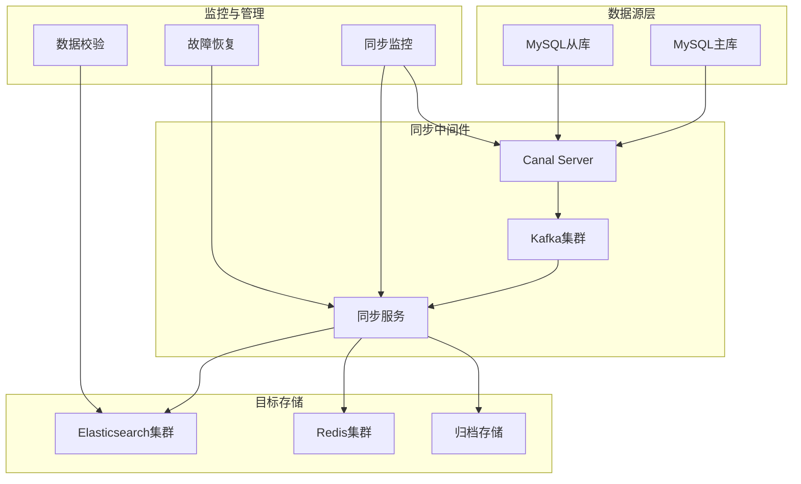
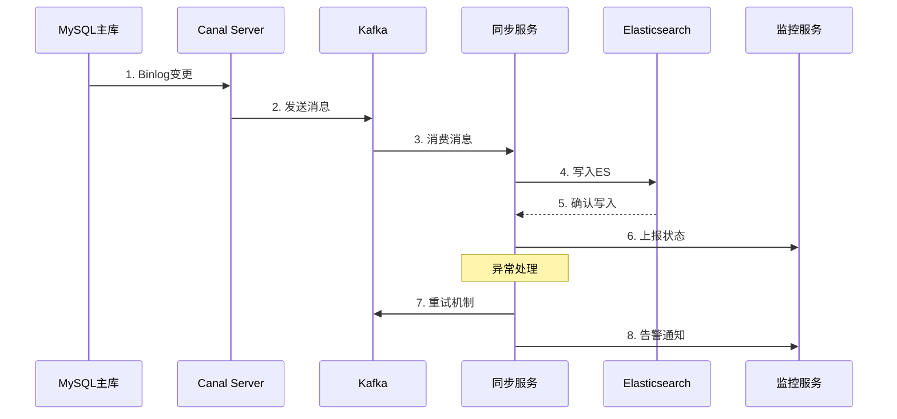
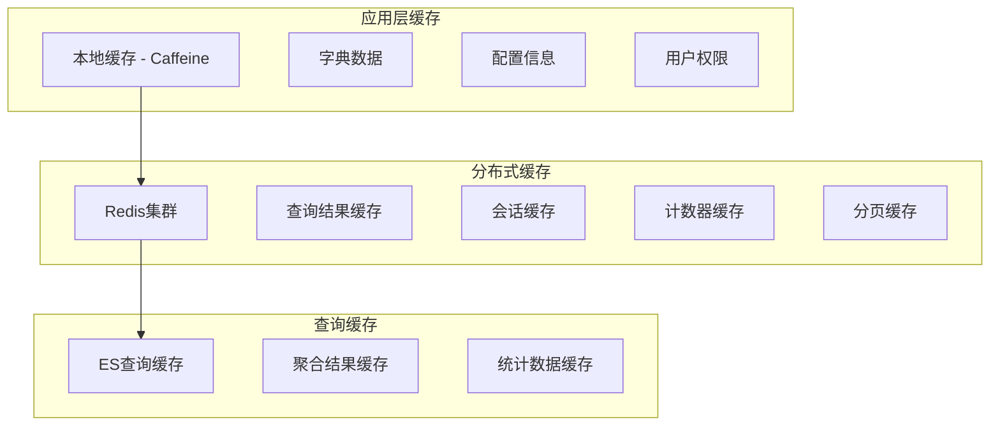

# 数据同步与缓存策略详细方案

## 1. 数据同步架构设计

### 1.1 整体同步架构



### 1.2 同步链路设计

#### MySQL → Elasticsearch 实时同步


## 2. Canal配置详细方案

### 2.1 Canal Server配置

```properties
# canal.properties
canal.id = 1
canal.ip = 192.168.1.100
canal.port = 11111
canal.metrics.pull.port = 11112

# MySQL连接配置
canal.instance.mysql.slaveId = 1234
canal.instance.master.address = 192.168.1.10:3306
canal.instance.dbUsername = canal
canal.instance.dbPassword = canal123
canal.instance.connectionCharset = UTF-8

# 过滤配置
canal.instance.filter.regex = testmgmt\\..*
canal.instance.filter.black.regex = testmgmt\\.temp_.*

# Kafka配置
canal.mq.topic = testmgmt_binlog
canal.mq.partition = 0
canal.mq.partitionsNum = 8
canal.mq.partitionHash = test_cases:case_id,test_executions:execution_id

# 性能配置
canal.instance.memory.buffer.size = 16384
canal.instance.memory.buffer.memunit = 1024
canal.instance.memory.rawEntry = true
```

### 2.2 表级别同步配置

```yaml
# canal_table_config.yml
tables:
  test_cases:
    source:
      database: testmgmt
      table: test_cases
    target:
      index: testmgmt_cases_2024_v1
      type: _doc
    transform:
      - field: created_at
        type: date
        format: "yyyy-MM-dd HH:mm:ss"
      - field: updated_at
        type: date
        format: "yyyy-MM-dd HH:mm:ss"
      - field: description
        type: text
        analyzer: ik_max_word
    filter:
      - field: status
        exclude_values: ["deleted", "temp"]
        
  test_executions:
    source:
      database: testmgmt
      table: test_executions
    target:
      index: testmgmt_executions_{YYYY-MM}_v1
      type: _doc
    partition_by: execution_time
    transform:
      - field: execution_time
        type: date
        format: "yyyy-MM-dd HH:mm:ss"
      - field: duration
        type: integer
        
  bugs:
    source:
      database: testmgmt
      table: bugs
    target:
      index: testmgmt_bugs_2024_v1
      type: _doc
    transform:
      - field: title
        type: text
        analyzer: ik_max_word
      - field: description
        type: text
        analyzer: ik_max_word
```

### 2.3 同步服务实现

```java
@Service
@Slf4j
public class DataSyncService {
    
    @Autowired
    private ElasticsearchClient esClient;
    
    @Autowired
    private RedisTemplate<String, Object> redisTemplate;
    
    @KafkaListener(topics = "testmgmt_binlog")
    public void handleBinlogMessage(ConsumerRecord<String, String> record) {
        try {
            BinlogMessage message = JSON.parseObject(record.value(), BinlogMessage.class);
            
            switch (message.getTable()) {
                case "test_cases":
                    syncTestCase(message);
                    break;
                case "test_executions":
                    syncTestExecution(message);
                    break;
                case "bugs":
                    syncBug(message);
                    break;
                default:
                    log.warn("Unknown table: {}", message.getTable());
            }
            
        } catch (Exception e) {
            log.error("Sync failed for record: {}", record.value(), e);
            // 发送到死信队列
            sendToDeadLetterQueue(record);
        }
    }
    
    private void syncTestCase(BinlogMessage message) {
        String indexName = "testmgmt_cases_2024_v1";
        String docId = message.getData().get("case_id").toString();
        
        switch (message.getType()) {
            case "INSERT":
            case "UPDATE":
                Map<String, Object> doc = transformTestCase(message.getData());
                esClient.index(IndexRequest.of(i -> i
                    .index(indexName)
                    .id(docId)
                    .document(doc)
                ));
                
                // 更新缓存
                updateCacheForTestCase(docId, doc);
                break;
                
            case "DELETE":
                esClient.delete(DeleteRequest.of(d -> d
                    .index(indexName)
                    .id(docId)
                ));
                
                // 清除缓存
                clearCacheForTestCase(docId);
                break;
        }
    }
    
    private Map<String, Object> transformTestCase(Map<String, Object> data) {
        Map<String, Object> doc = new HashMap<>();
        
        // 基础字段转换
        doc.put("case_id", data.get("uid"));
        doc.put("tenant_id", data.get("tenant_id"));
        doc.put("name", data.get("name"));
        doc.put("description", data.get("description"));
        doc.put("priority", data.get("priority"));
        doc.put("status", data.get("review_state"));
        
        // 时间字段转换
        if (data.get("created_at") != null) {
            doc.put("created_at", formatDateTime(data.get("created_at")));
        }
        
        // 标签处理
        String tags = (String) data.get("tags");
        if (StringUtils.isNotBlank(tags)) {
            doc.put("tags", Arrays.asList(tags.split(",")));
        }
        
        return doc;
    }
}
```

## 3. 缓存策略设计

### 3.1 多层缓存架构



### 3.2 缓存配置策略

#### 本地缓存配置
```java
@Configuration
public class LocalCacheConfig {
    
    @Bean
    public Cache<String, Object> dictCache() {
        return Caffeine.newBuilder()
            .maximumSize(10000)
            .expireAfterWrite(1, TimeUnit.HOURS)
            .refreshAfterWrite(30, TimeUnit.MINUTES)
            .recordStats()
            .build();
    }
    
    @Bean
    public Cache<String, UserPermission> permissionCache() {
        return Caffeine.newBuilder()
            .maximumSize(50000)
            .expireAfterWrite(30, TimeUnit.MINUTES)
            .refreshAfterWrite(10, TimeUnit.MINUTES)
            .recordStats()
            .build();
    }
}
```

#### Redis缓存配置
```yaml
# redis_cache_config.yml
cache_configs:
  # 查询结果缓存
  query_result:
    key_pattern: "query:result:{tenant_id}:{query_hash}"
    ttl: 600  # 10分钟
    max_size: 1000000
    
  # 用户会话缓存
  user_session:
    key_pattern: "session:{user_id}"
    ttl: 7200  # 2小时
    max_size: 100000
    
  # 计数器缓存
  counters:
    key_pattern: "counter:{type}:{tenant_id}:{date}"
    ttl: 300   # 5分钟
    max_size: 50000
    
  # 分页查询缓存
  pagination:
    key_pattern: "page:{tenant_id}:{table}:{page}:{size}:{filters_hash}"
    ttl: 300   # 5分钟
    max_size: 200000
```

### 3.3 缓存更新策略

#### 缓存失效策略
```java
@Service
public class CacheInvalidationService {
    
    @Autowired
    private RedisTemplate<String, Object> redisTemplate;
    
    @EventListener
    public void handleTestCaseUpdate(TestCaseUpdateEvent event) {
        String tenantId = event.getTenantId();
        String caseId = event.getCaseId();
        
        // 清除相关查询缓存
        String pattern = String.format("query:result:%s:*", tenantId);
        Set<String> keys = redisTemplate.keys(pattern);
        if (!keys.isEmpty()) {
            redisTemplate.delete(keys);
        }
        
        // 清除分页缓存
        pattern = String.format("page:%s:test_cases:*", tenantId);
        keys = redisTemplate.keys(pattern);
        if (!keys.isEmpty()) {
            redisTemplate.delete(keys);
        }
        
        // 更新计数器
        updateCounters(tenantId, "test_case_update");
    }
    
    @Async
    public void preloadCache(String tenantId, String cacheType) {
        switch (cacheType) {
            case "hot_queries":
                preloadHotQueries(tenantId);
                break;
            case "user_permissions":
                preloadUserPermissions(tenantId);
                break;
            case "dict_data":
                preloadDictData(tenantId);
                break;
        }
    }
}
```

### 3.4 缓存预热策略

```java
@Component
@Slf4j
public class CacheWarmupService {
    
    @Scheduled(cron = "0 0 1 * * ?") // 每天凌晨1点
    public void dailyWarmup() {
        log.info("Starting daily cache warmup");
        
        // 预热热点查询
        warmupHotQueries();
        
        // 预热字典数据
        warmupDictData();
        
        // 预热用户权限
        warmupUserPermissions();
        
        log.info("Daily cache warmup completed");
    }
    
    private void warmupHotQueries() {
        // 获取昨日热点查询
        List<HotQuery> hotQueries = getYesterdayHotQueries();
        
        for (HotQuery query : hotQueries) {
            try {
                // 执行查询并缓存结果
                Object result = executeQuery(query);
                cacheQueryResult(query, result);
                
                Thread.sleep(100); // 避免过载
            } catch (Exception e) {
                log.error("Failed to warmup query: {}", query, e);
            }
        }
    }
}
```

## 4. 数据一致性保障

### 4.1 一致性检查机制

```java
@Service
@Slf4j
public class DataConsistencyService {
    
    @Scheduled(fixedRate = 300000) // 5分钟检查一次
    public void checkDataConsistency() {
        
        // 检查MySQL与ES数据一致性
        checkMySQLESConsistency();
        
        // 检查缓存数据一致性
        checkCacheConsistency();
        
        // 检查计数器一致性
        checkCounterConsistency();
    }
    
    private void checkMySQLESConsistency() {
        // 获取最近更新的数据
        List<String> recentUpdatedIds = getRecentUpdatedIds();
        
        for (String id : recentUpdatedIds) {
            try {
                // 从MySQL获取数据
                TestCase mysqlData = testCaseRepository.findById(id);
                
                // 从ES获取数据
                TestCase esData = searchTestCaseInES(id);
                
                // 比较数据
                if (!isDataConsistent(mysqlData, esData)) {
                    log.warn("Data inconsistency found for id: {}", id);
                    
                    // 修复数据
                    repairDataInconsistency(id, mysqlData);
                }
                
            } catch (Exception e) {
                log.error("Failed to check consistency for id: {}", id, e);
            }
        }
    }
    
    private void repairDataInconsistency(String id, TestCase correctData) {
        try {
            // 重新同步到ES
            syncToElasticsearch(correctData);
            
            // 清除相关缓存
            clearRelatedCache(id);
            
            // 记录修复日志
            logDataRepair(id, "mysql_es_inconsistency");
            
        } catch (Exception e) {
            log.error("Failed to repair data inconsistency for id: {}", id, e);
            
            // 发送告警
            sendAlert("data_repair_failed", id);
        }
    }
}
```

### 4.2 补偿机制

```java
@Service
public class DataCompensationService {
    
    @RetryableTopic(
        attempts = "3",
        backoff = @Backoff(delay = 1000, multiplier = 2.0),
        dltStrategy = DltStrategy.FAIL_ON_ERROR
    )
    @KafkaListener(topics = "testmgmt_binlog_retry")
    public void handleRetryMessage(BinlogMessage message) {
        try {
            // 重新处理失败的同步消息
            processMessage(message);
            
        } catch (Exception e) {
            log.error("Retry failed for message: {}", message, e);
            throw e; // 触发DLT
        }
    }
    
    @KafkaListener(topics = "testmgmt_binlog_retry.DLT")
    public void handleDeadLetterMessage(BinlogMessage message) {
        // 记录到死信表
        saveToDeadLetterTable(message);
        
        // 发送告警
        sendAlert("message_processing_failed", message);
        
        // 可选：人工介入处理
        createManualTask(message);
    }
    
    @Scheduled(fixedRate = 600000) // 10分钟执行一次
    public void processDeadLetterMessages() {
        List<DeadLetterMessage> messages = getUnprocessedDeadLetterMessages();
        
        for (DeadLetterMessage dlm : messages) {
            try {
                // 尝试重新处理
                BinlogMessage originalMessage = JSON.parseObject(dlm.getContent(), BinlogMessage.class);
                processMessage(originalMessage);
                
                // 标记为已处理
                markAsProcessed(dlm.getId());
                
            } catch (Exception e) {
                log.error("Failed to process dead letter message: {}", dlm.getId(), e);
                
                // 增加重试次数
                incrementRetryCount(dlm.getId());
            }
        }
    }
}
```

## 5. 性能监控与优化

### 5.1 同步性能监控

```java
@Component
@Slf4j
public class SyncPerformanceMonitor {
    
    private final MeterRegistry meterRegistry;
    private final Counter syncSuccessCounter;
    private final Counter syncFailureCounter;
    private final Timer syncLatencyTimer;
    
    public SyncPerformanceMonitor(MeterRegistry meterRegistry) {
        this.meterRegistry = meterRegistry;
        this.syncSuccessCounter = Counter.builder("sync.success")
            .description("Successful sync operations")
            .register(meterRegistry);
        this.syncFailureCounter = Counter.builder("sync.failure")
            .description("Failed sync operations")
            .register(meterRegistry);
        this.syncLatencyTimer = Timer.builder("sync.latency")
            .description("Sync operation latency")
            .register(meterRegistry);
    }
    
    public void recordSyncSuccess(String table, long latency) {
        syncSuccessCounter.increment(Tags.of("table", table));
        syncLatencyTimer.record(latency, TimeUnit.MILLISECONDS);
    }
    
    public void recordSyncFailure(String table, String errorType) {
        syncFailureCounter.increment(Tags.of("table", table, "error", errorType));
    }
    
    @Scheduled(fixedRate = 60000) // 每分钟输出一次
    public void reportMetrics() {
        double successRate = syncSuccessCounter.count() / 
            (syncSuccessCounter.count() + syncFailureCounter.count()) * 100;
        
        log.info("Sync metrics - Success rate: {:.2f}%, Avg latency: {:.2f}ms", 
            successRate, syncLatencyTimer.mean(TimeUnit.MILLISECONDS));
    }
}
```

### 5.2 缓存性能监控

```java
@Component
public class CachePerformanceMonitor {
    
    @EventListener
    public void handleCacheHit(CacheHitEvent event) {
        Metrics.counter("cache.hit", 
            "cache", event.getCacheName(),
            "tenant", event.getTenantId())
            .increment();
    }
    
    @EventListener
    public void handleCacheMiss(CacheMissEvent event) {
        Metrics.counter("cache.miss",
            "cache", event.getCacheName(),
            "tenant", event.getTenantId())
            .increment();
    }
    
    @Scheduled(fixedRate = 300000) // 5分钟统计一次
    public void reportCacheStats() {
        // 本地缓存统计
        CacheStats dictStats = dictCache.stats();
        log.info("Dict cache - Hit rate: {:.2f}%, Evictions: {}", 
            dictStats.hitRate() * 100, dictStats.evictionCount());
        
        // Redis缓存统计
        RedisInfo redisInfo = getRedisInfo();
        log.info("Redis cache - Memory usage: {}MB, Hit rate: {:.2f}%",
            redisInfo.getUsedMemory() / 1024 / 1024, redisInfo.getHitRate() * 100);
    }
}
```

## 6. 故障处理与恢复

### 6.1 故障检测

```java
@Service
public class FailureDetectionService {
    
    @Scheduled(fixedRate = 30000) // 30秒检查一次
    public void checkSyncHealth() {
        
        // 检查Canal连接状态
        if (!isCanalHealthy()) {
            handleCanalFailure();
        }
        
        // 检查Kafka连接状态
        if (!isKafkaHealthy()) {
            handleKafkaFailure();
        }
        
        // 检查ES连接状态
        if (!isElasticsearchHealthy()) {
            handleElasticsearchFailure();
        }
        
        // 检查同步延迟
        long syncDelay = getCurrentSyncDelay();
        if (syncDelay > MAX_SYNC_DELAY) {
            handleSyncDelayAlert(syncDelay);
        }
    }
    
    private void handleCanalFailure() {
        log.error("Canal connection failed");
        
        // 发送告警
        sendAlert("canal_connection_failed");
        
        // 尝试重启Canal
        restartCanal();
        
        // 切换到备用Canal实例
        switchToBackupCanal();
    }
    
    private void handleSyncDelayAlert(long delay) {
        log.warn("Sync delay too high: {}ms", delay);
        
        // 发送告警
        sendAlert("sync_delay_high", Map.of("delay", delay));
        
        // 增加同步并发度
        increaseSyncConcurrency();
        
        // 清理积压消息
        cleanupBacklogMessages();
    }
}
```

### 6.2 自动恢复机制

```java
@Service
public class AutoRecoveryService {
    
    @EventListener
    public void handleSyncFailure(SyncFailureEvent event) {
        String recoveryStrategy = determineRecoveryStrategy(event);
        
        switch (recoveryStrategy) {
            case "retry":
                scheduleRetry(event);
                break;
            case "skip":
                skipMessage(event);
                break;
            case "manual":
                createManualTask(event);
                break;
            case "full_resync":
                scheduleFullResync(event.getTenantId());
                break;
        }
    }
    
    private void scheduleFullResync(String tenantId) {
        log.info("Scheduling full resync for tenant: {}", tenantId);
        
        // 创建全量同步任务
        FullResyncTask task = FullResyncTask.builder()
            .tenantId(tenantId)
            .startTime(Instant.now())
            .status("PENDING")
            .build();
        
        fullResyncTaskRepository.save(task);
        
        // 异步执行全量同步
        CompletableFuture.runAsync(() -> executeFullResync(task));
    }
    
    private void executeFullResync(FullResyncTask task) {
        try {
            task.setStatus("RUNNING");
            fullResyncTaskRepository.save(task);
            
            // 1. 从MySQL全量导出数据
            List<TestCase> allTestCases = exportAllTestCases(task.getTenantId());
            
            // 2. 清空ES中的数据
            clearElasticsearchData(task.getTenantId());
            
            // 3. 批量导入到ES
            batchImportToElasticsearch(allTestCases);
            
            // 4. 验证数据完整性
            validateDataIntegrity(task.getTenantId());
            
            task.setStatus("COMPLETED");
            task.setEndTime(Instant.now());
            
        } catch (Exception e) {
            log.error("Full resync failed for tenant: {}", task.getTenantId(), e);
            task.setStatus("FAILED");
            task.setErrorMessage(e.getMessage());
            
            // 发送告警
            sendAlert("full_resync_failed", task.getTenantId());
        } finally {
            fullResyncTaskRepository.save(task);
        }
    }
}
```

## 7. 配置管理与部署

### 7.1 环境配置

```yaml
# application-prod.yml
sync:
  canal:
    servers:
      - host: canal-1.prod.com
        port: 11111
      - host: canal-2.prod.com
        port: 11111
    failover: true
    
  kafka:
    bootstrap-servers: kafka-1:9092,kafka-2:9092,kafka-3:9092
    consumer:
      group-id: testmgmt-sync-group
      auto-offset-reset: earliest
      max-poll-records: 500
    producer:
      retries: 3
      batch-size: 16384
      
  elasticsearch:
    hosts: es-1:9200,es-2:9200,es-3:9200
    connection-timeout: 5000
    socket-timeout: 60000
    
  redis:
    cluster:
      nodes: redis-1:6379,redis-2:6379,redis-3:6379
    timeout: 3000
    max-redirects: 3
    
  performance:
    sync-batch-size: 1000
    sync-thread-pool-size: 20
    cache-refresh-interval: 300
    consistency-check-interval: 300
```

### 7.2 监控配置

```yaml
# monitoring.yml
monitoring:
  metrics:
    enabled: true
    export:
      prometheus:
        enabled: true
        step: 30s
        
  alerts:
    - name: sync_failure_rate_high
      condition: rate(sync_failure_total[5m]) > 0.1
      duration: 2m
      severity: warning
      
    - name: sync_delay_high
      condition: sync_latency_seconds > 10
      duration: 1m
      severity: critical
      
    - name: cache_hit_rate_low
      condition: cache_hit_rate < 0.8
      duration: 5m
      severity: warning
```

这个数据同步与缓存策略方案提供了完整的实时数据同步能力，多层缓存优化，以及完善的监控和故障恢复机制，能够很好地支持您的高并发测试管理系统需求。