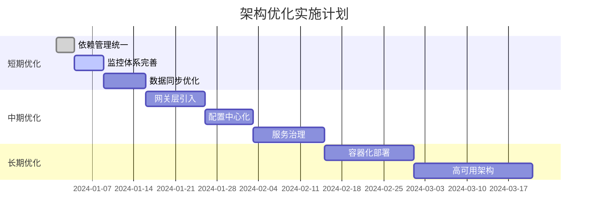

# 多租户测试管理系统架构优化方案

## 1. 当前架构问题分析

### 存在问题：
1. **依赖管理混乱**：版本不统一，存在冲突
2. **缺少网关层**：没有统一入口和路由
3. **配置分散**：各服务配置独立管理
4. **监控不完整**：缺少完整的监控体系
5. **数据一致性**：MySQL与ES同步机制不够完善

## 2. 优化后的架构设计

### 2.1 整体架构层次
```
┌─────────────────────────────────────────────────────────────┐
│                        前端层                                │
├─────────────────────────────────────────────────────────────┤
│                     网关层 (Gateway)                         │
├─────────────────────────────────────────────────────────────┤
│                    服务层 (Microservices)                   │
│  ┌─────────────┐ ┌─────────────┐ ┌─────────────┐ ┌─────────┐│
│  │租户管理服务  │ │测试执行服务  │ │需求管理服务  │ │缺陷管理 ││
│  └─────────────┘ └─────────────┘ └─────────────┘ └─────────┘│
├─────────────────────────────────────────────────────────────┤
│                   基础组件层 (Starters)                      │
│  ┌─────────────┐ ┌─────────────┐ ┌─────────────┐ ┌─────────┐│
│  │租户路由组件  │ │导入导出组件  │ │ID生成组件   │ │ES组件   ││
│  └─────────────┘ └─────────────┘ └─────────────┘ └─────────┘│
├─────────────────────────────────────────────────────────────┤
│                    数据存储层                                │
│  ┌─────────────┐ ┌─────────────┐ ┌─────────────┐ ┌─────────┐│
│  │MySQL集群    │ │Redis集群    │ │ES集群       │ │ActiveMQ ││
│  └─────────────┘ └─────────────┘ └─────────────┘ └─────────┘│
└─────────────────────────────────────────────────────────────┘
```

### 2.2 核心优化点

#### A. 统一网关层
- 使用Spring Cloud Gateway
- 统一认证授权
- 租户路由规则
- 限流熔断
- 日志追踪

#### B. 配置中心
- 使用Nacos作为配置中心
- 动态配置刷新
- 环境隔离
- 配置版本管理

#### C. 服务注册发现
- 使用Nacos作为注册中心
- 服务健康检查
- 负载均衡
- 服务治理

## 3. 数据架构优化

### 3.1 多租户数据隔离策略
```
租户中心库 (tenant_center)
├── tenant_info (租户信息)
├── tenant_datasource (租户数据源配置)
├── sequence (ID生成序列)
└── system_config (系统配置)

租户业务库 (db_tenant_{id})
├── test_case (测试用例)
├── test_execution (测试执行)
├── bug_info (缺陷信息)
├── requirement (需求信息)
└── import_export_task (导入导出任务)
```

### 3.2 数据同步策略
- **实时同步**：使用Canal监听MySQL binlog
- **批量同步**：定时任务批量同步
- **补偿机制**：数据一致性校验和修复
- **队列缓冲**：使用Redis Stream作为消息队列

## 4. 性能优化策略

### 4.1 数据库优化
- 分库分表策略
- 读写分离
- 连接池优化
- 索引优化

### 4.2 缓存策略
- 多级缓存架构
- 缓存预热
- 缓存穿透防护
- 分布式锁

### 4.3 搜索优化
- ES索引设计优化
- 查询性能调优
- 聚合查询优化
- 索引生命周期管理#
# 5. 具体实施建议

### 5.1 短期优化（1-2周）
1. **统一依赖管理**
   - 修改父POM，统一版本管理
   - 解决依赖冲突问题
   - 标准化starter结构

2. **完善监控体系**
   - 集成Micrometer + Prometheus
   - 添加业务指标监控
   - 完善日志链路追踪

3. **数据一致性增强**
   - 完善MySQL到ES的同步机制
   - 添加数据校验和修复功能
   - 优化批量操作性能

### 5.2 中期优化（1个月）
1. **引入网关层**
   - 部署Spring Cloud Gateway
   - 实现统一认证和路由
   - 添加限流熔断功能

2. **配置中心化**
   - 部署Nacos配置中心
   - 迁移配置到配置中心
   - 实现动态配置刷新

3. **服务治理**
   - 服务注册发现
   - 健康检查机制
   - 负载均衡策略

### 5.3 长期优化（2-3个月）
1. **容器化部署**
   - Docker镜像标准化
   - Kubernetes部署
   - CI/CD流水线

2. **高可用架构**
   - 多机房部署
   - 灾备方案
   - 自动故障转移

## 6. 技术选型建议

### 6.1 推荐的技术栈升级
```yaml
# 当前 -> 推荐
Spring Boot: 2.7.x -> 2.7.18 (统一版本)
Spring Cloud: 无 -> 2021.0.8
网关: 无 -> Spring Cloud Gateway
注册中心: 无 -> Nacos 2.2.x
配置中心: 无 -> Nacos 2.2.x
消息队列: ActiveMQ -> RocketMQ/Kafka (可选)
监控: 基础 -> Prometheus + Grafana + SkyWalking
```

### 6.2 数据同步方案选择
**推荐使用Canal + Redis Stream方案**：
- **可靠性高**：Canal基于binlog，数据不丢失
- **性能好**：异步处理，不影响业务性能
- **实时性强**：毫秒级延迟
- **易运维**：成熟的开源方案

## 7. 风险评估与应对

### 7.1 主要风险
1. **数据迁移风险**：大量租户数据迁移
2. **性能风险**：2000+租户并发访问
3. **一致性风险**：分布式数据一致性
4. **运维复杂度**：微服务架构运维复杂

### 7.2 应对策略
1. **灰度发布**：分批次升级，降低风险
2. **压力测试**：充分的性能测试验证
3. **监控告警**：完善的监控和告警机制
4. **回滚方案**：快速回滚机制

## 8. 实施路线图



这个优化方案既保持了你现有架构的优点，又解决了存在的问题，是一个渐进式的优化路径。你觉得这个方案如何？有哪些地方需要调整？