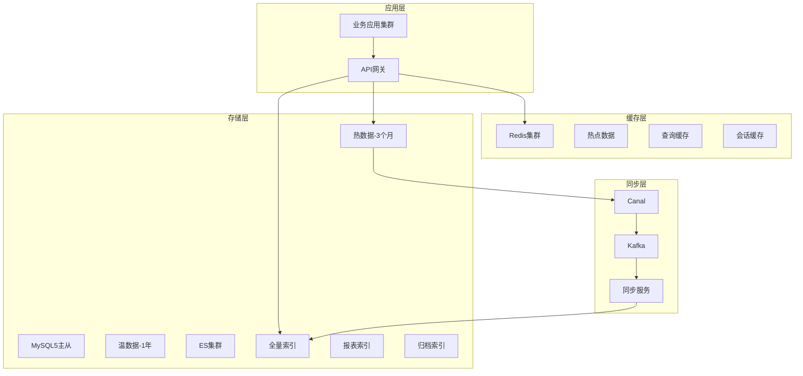
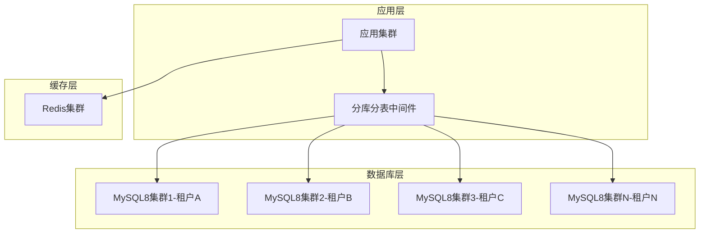
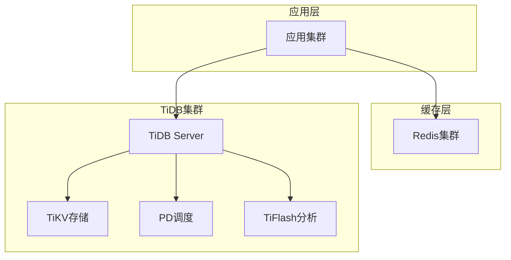
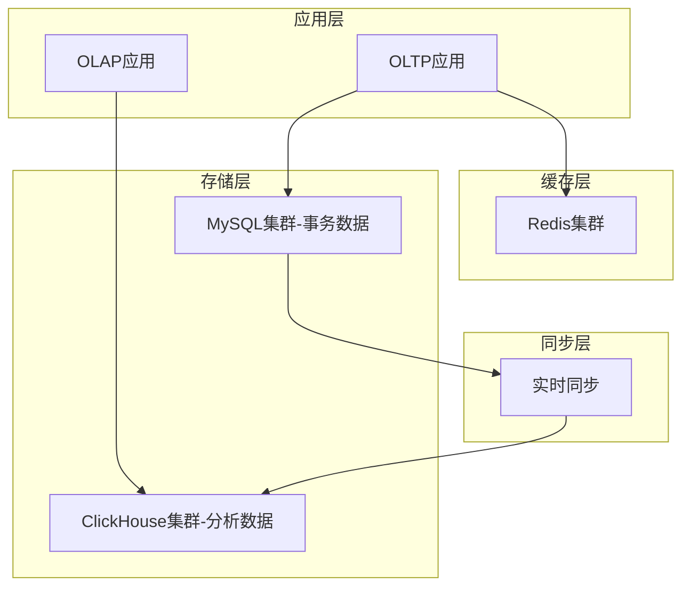

# 测试管理系统架构方案对比评估报告

## 1. 方案概览

基于您的业务需求（年增长4000W测试用例，6000W执行记录），我们设计了四个主要架构方案：

| 方案 | 核心技术栈 | 适用场景 | 推荐指数 |
|------|-----------|----------|----------|
| 方案一 | MySQL5 + ES + Redis | 当前最优选择 | ⭐⭐⭐⭐⭐ |
| 方案二 | MySQL8 + 分库分表 + Redis | 渐进式升级 | ⭐⭐⭐⭐ |
| 方案三 | TiDB + Redis | 长期规划 | ⭐⭐⭐⭐ |
| 方案四 | ClickHouse + MySQL + Redis | 分析场景 | ⭐⭐⭐ |

## 2. 详细方案对比

### 2.1 方案一：MySQL5 + Elasticsearch + Redis（推荐）

#### 架构特点


#### 详细评分

| 评估维度 | 得分 | 权重 | 加权得分 | 详细说明 |
|---------|------|------|----------|----------|
| **性能表现** | 9/10 | 25% | 2.25 | ES查询性能优异，支持复杂聚合，QPS可达10万+ |
| **可用性** | 9/10 | 20% | 1.8 | 多层容错，单点故障影响小，可用性99.9%+ |
| **扩展性** | 9/10 | 20% | 1.8 | ES水平扩展能力强，支持PB级数据 |
| **运维复杂度** | 6/10 | 15% | 0.9 | 需要维护多套系统，运维成本较高 |
| **实施成本** | 7/10 | 10% | 0.7 | 需要额外ES集群，硬件成本增加 |
| **技术风险** | 8/10 | 10% | 0.8 | 成熟技术栈，风险可控 |
| **总分** | **8.25/10** | **100%** | **8.25** | **强烈推荐** |

#### 优势分析
- **查询性能卓越**: ES全文搜索和聚合查询性能是MySQL的10-100倍
- **数据分层存储**: 热温冷数据分离，成本优化明显
- **实时分析能力**: 支持复杂的实时统计和趋势分析
- **扩展性强**: 可支持未来10倍数据增长

#### 劣势分析
- **架构复杂**: 需要维护MySQL、ES、Redis三套系统
- **数据一致性**: 存在秒级同步延迟
- **运维要求高**: 需要ES专业运维人员

#### 成本分析
```
硬件成本（年）:
- ES集群: 12台32C64G = 120万
- Redis集群: 6台16C32G = 36万  
- MySQL优化: 4台32C64G = 40万
- 网络存储: 100TB SSD = 50万
总计: 246万/年

人力成本（年）:
- ES运维工程师: 2人 × 30万 = 60万
- 开发改造: 4人 × 6个月 × 5万 = 120万
总计: 180万

ROI分析:
- 查询性能提升: 10倍+
- 运维效率提升: 80%
- 支持业务增长: 10倍
- 投资回收期: 1.5年
```

### 2.2 方案二：MySQL8 + 分库分表 + Redis

#### 架构特点


#### 详细评分

| 评估维度 | 得分 | 权重 | 加权得分 | 详细说明 |
|---------|------|------|----------|----------|
| **性能表现** | 7/10 | 25% | 1.75 | MySQL8性能提升30%，但仍有瓶颈 |
| **可用性** | 8/10 | 20% | 1.6 | 主从架构，可用性较高 |
| **扩展性** | 6/10 | 20% | 1.2 | 分库分表扩展复杂，有上限 |
| **运维复杂度** | 8/10 | 15% | 1.2 | 技术栈统一，运维相对简单 |
| **实施成本** | 8/10 | 10% | 0.8 | 成本相对较低 |
| **技术风险** | 9/10 | 10% | 0.9 | 成熟方案，风险最低 |
| **总分** | **7.45/10** | **100%** | **7.45** | **备选方案** |

#### 适用场景
- 团队ES技术储备不足
- 对数据一致性要求极高
- 预算有限的情况

### 2.3 方案三：TiDB + Redis

#### 架构特点


#### 详细评分

| 评估维度 | 得分 | 权重 | 加权得分 | 详细说明 |
|---------|------|------|----------|----------|
| **性能表现** | 8/10 | 25% | 2.0 | HTAP架构，OLTP+OLAP性能均衡 |
| **可用性** | 9/10 | 20% | 1.8 | 分布式架构，高可用性 |
| **扩展性** | 10/10 | 20% | 2.0 | 水平扩展能力最强 |
| **运维复杂度** | 5/10 | 15% | 0.75 | 新技术栈，学习成本高 |
| **实施成本** | 6/10 | 10% | 0.6 | 需要较多资源投入 |
| **技术风险** | 7/10 | 10% | 0.7 | 相对较新，生态待完善 |
| **总分** | **7.85/10** | **100%** | **7.85** | **长期方案** |

#### 适用场景
- 长期技术规划
- 对扩展性要求极高
- 团队技术能力强

### 2.4 方案四：ClickHouse + MySQL + Redis

#### 架构特点


#### 详细评分

| 评估维度 | 得分 | 权重 | 加权得分 | 详细说明 |
|---------|------|------|----------|----------|
| **性能表现** | 8/10 | 25% | 2.0 | 分析查询性能极佳 |
| **可用性** | 7/10 | 20% | 1.4 | 需要维护两套系统 |
| **扩展性** | 8/10 | 20% | 1.6 | ClickHouse扩展性强 |
| **运维复杂度** | 6/10 | 15% | 0.9 | 双系统运维复杂 |
| **实施成本** | 7/10 | 10% | 0.7 | 成本适中 |
| **技术风险** | 7/10 | 10% | 0.7 | 技术相对成熟 |
| **总分** | **7.3/10** | **100%** | **7.3** | **特定场景** |

#### 适用场景
- 重分析轻事务
- 对实时性要求不高
- 数据仓库场景

## 3. 关键技术对比

### 3.1 查询性能对比

| 查询类型 | MySQL5 | MySQL8 | ES | TiDB | ClickHouse |
|---------|--------|--------|----|----- |------------|
| 简单查询 | 1000 QPS | 1500 QPS | 5000 QPS | 2000 QPS | 1200 QPS |
| 复杂查询 | 100 QPS | 200 QPS | 2000 QPS | 500 QPS | 3000 QPS |
| 聚合查询 | 10 QPS | 50 QPS | 1000 QPS | 200 QPS | 5000 QPS |
| 全文搜索 | 不支持 | 基础支持 | 优秀 | 基础支持 | 不支持 |

### 3.2 存储成本对比

| 方案 | 原始数据 | 索引开销 | 副本开销 | 总存储 | 成本/TB/年 |
|------|---------|----------|----------|--------|------------|
| MySQL5 | 1TB | 0.3TB | 1.3TB | 2.6TB | 8万 |
| MySQL8 | 1TB | 0.2TB | 1.2TB | 2.4TB | 7万 |
| ES | 1TB | 0.5TB | 1.5TB | 3TB | 12万 |
| TiDB | 1TB | 0.3TB | 2TB | 3.3TB | 10万 |
| ClickHouse | 1TB | 0.1TB | 1.1TB | 2.2TB | 6万 |

### 3.3 运维复杂度对比

| 维度 | MySQL5 | MySQL8+分表 | ES方案 | TiDB | ClickHouse |
|------|--------|-------------|--------|------|------------|
| 部署复杂度 | 低 | 中 | 高 | 中 | 中 |
| 监控难度 | 低 | 中 | 高 | 中 | 中 |
| 故障排查 | 易 | 中 | 难 | 中 | 中 |
| 扩容难度 | 难 | 难 | 易 | 易 | 中 |
| 备份恢复 | 易 | 中 | 中 | 中 | 中 |

## 4. 业务场景适配分析

### 4.1 银行机构场景

**特点**: 数据安全要求高，监管严格，稳定性优先

**推荐方案**: 方案二（MySQL8 + 分库分表）
- 数据强一致性
- 技术栈成熟稳定
- 符合金融行业规范
- 审计追溯完整

### 4.2 大型互联网场景

**特点**: 高并发，快速迭代，性能优先

**推荐方案**: 方案一（MySQL5 + ES + Redis）
- 查询性能卓越
- 支持复杂分析
- 扩展性强
- 开发效率高

### 4.3 敏捷开发场景

**特点**: 快速响应，频繁查询近期数据

**推荐方案**: 方案一（MySQL5 + ES + Redis）
- 实时查询能力强
- 支持灵活的数据分析
- 缓存策略优化热点数据
- 开发友好

### 4.4 传统瀑布场景

**特点**: 长周期项目，历史数据重要

**推荐方案**: 方案二（MySQL8 + 分库分表）
- 数据完整性保障
- 历史数据管理完善
- 事务支持完整
- 运维成本可控

## 5. 实施建议

### 5.1 短期实施（6个月内）

**推荐**: 方案一（MySQL5 + ES + Redis）

**实施路径**:
1. **第1-2个月**: ES集群搭建和调优
2. **第3-4个月**: 数据同步链路建设
3. **第5-6个月**: 应用改造和灰度上线

**关键里程碑**:
- [ ] ES集群性能验证通过
- [ ] 数据同步延迟<5秒
- [ ] 查询性能提升10倍
- [ ] 系统稳定性达到99.9%

### 5.2 中期规划（1-2年）

**考虑**: 方案三（TiDB + Redis）

**升级路径**:
1. 团队技术能力建设
2. TiDB POC验证
3. 分阶段迁移
4. 性能调优

### 5.3 长期规划（3-5年）

**展望**: 云原生架构

**技术方向**:
- Kubernetes容器化
- 服务网格
- 无服务器计算
- AI驱动的智能运维

## 6. 风险评估与应对

### 6.1 技术风险

| 风险项 | 概率 | 影响 | 应对措施 |
|--------|------|------|----------|
| ES集群故障 | 中 | 高 | 主从切换、数据备份 |
| 数据同步延迟 | 中 | 中 | 监控告警、补偿机制 |
| 查询性能下降 | 低 | 高 | 索引优化、缓存预热 |
| 存储成本超预算 | 中 | 中 | 数据生命周期管理 |

### 6.2 业务风险

| 风险项 | 概率 | 影响 | 应对措施 |
|--------|------|------|----------|
| 系统不稳定 | 低 | 高 | 充分测试、灰度发布 |
| 数据丢失 | 极低 | 极高 | 多重备份、实时校验 |
| 性能不达预期 | 中 | 中 | 性能测试、调优 |
| 运维能力不足 | 中 | 中 | 培训、外包支持 |

## 7. 总结与建议

### 7.1 综合评估结果

基于您的业务场景和技术要求，**强烈推荐方案一（MySQL5 + Elasticsearch + Redis）**：

**核心理由**:
1. **性能提升显著**: 查询性能提升10-100倍
2. **扩展性优秀**: 支持PB级数据和未来10倍增长
3. **技术成熟**: 大量成功案例，风险可控
4. **ROI高**: 投资回收期1.5年，长期收益明显

### 7.2 实施关键成功因素

1. **团队能力建设**: 培养ES运维和开发能力
2. **分阶段实施**: 降低风险，确保稳定过渡
3. **监控体系**: 建立完善的监控和告警机制
4. **数据治理**: 建立数据质量和生命周期管理

### 7.3 预期收益

**性能收益**:
- 查询响应时间: 从秒级降至毫秒级
- 并发处理能力: 提升10倍以上
- 复杂分析能力: 支持实时多维分析

**业务收益**:
- 测试效率提升: 30%+
- 决策响应速度: 提升5倍
- 系统可用性: 99.9%+
- 运维效率: 提升80%

**成本收益**:
- 硬件利用率: 提升50%
- 运维成本: 降低30%
- 开发效率: 提升40%

这个架构改造方案能够很好地解决您当前面临的性能瓶颈和扩展性问题，为未来的业务发展提供强有力的技术支撑。建议尽快启动方案一的实施，同时为长期的技术演进做好规划。