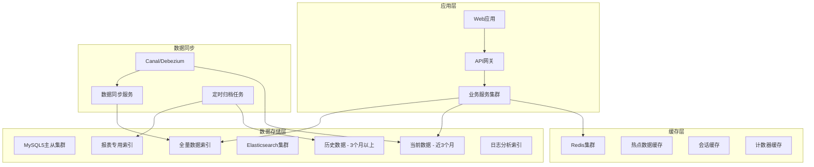
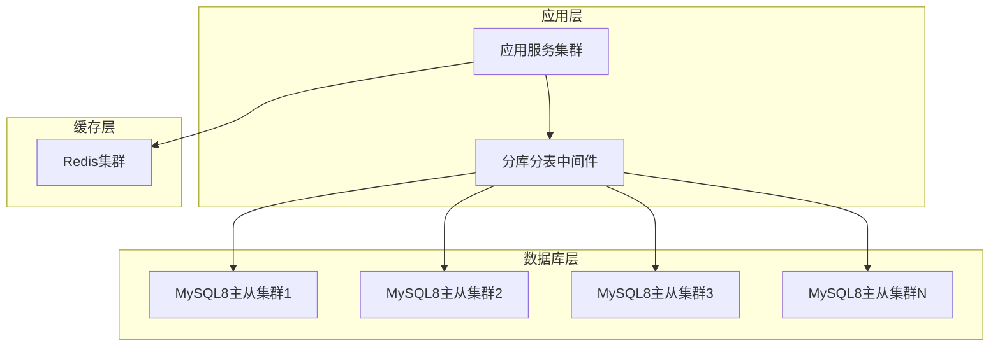
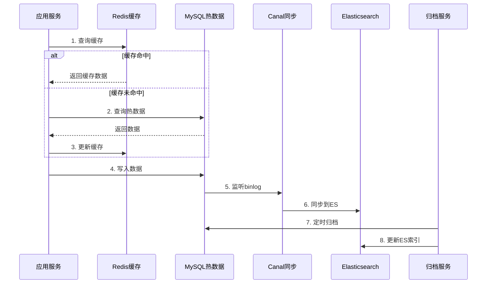

# 测试管理系统高可用架构改造方案

## 1. 现状分析

### 1.1 当前架构问题
- **数据量巨大**: 测试用例单表年增长4000W，执行记录6000W，其他表2000W
- **性能瓶颈**: MySQL5单库性能有限，查询响应慢
- **运维复杂**: 每年需手动创建按年份分库分表
- **扩展困难**: ShardingJDBC按年分库+按ID取模12表，扩展性差
- **报表压力**: 大量统计查询直接冲击业务库

### 1.2 业务特点分析
- **面向银行/大型互联网**: 高可用、高性能、数据安全要求极高
- **敏捷为主**: 快速迭代，频繁查询近期数据
- **瀑布为辅**: 长周期项目，需要历史数据追溯
- **多租户**: 不同机构/部门数据隔离
- **报表需求**: 实时统计、趋势分析、合规报告

## 2. 架构方案设计

### 方案一：MySQL5 + Elasticsearch + Redis 三层架构（推荐）

#### 2.1 架构图


#### 2.2 核心设计思路

**数据分层存储**:
- **热数据层(MySQL)**: 近3个月活跃数据，支持事务操作
- **温数据层(ES)**: 全量数据，支持复杂查询和统计
- **冷数据层(MySQL归档)**: 历史数据，定期备份

**缓存策略**:
- **L1缓存(本地)**: 字典数据、配置信息
- **L2缓存(Redis)**: 热点查询结果、用户会话
- **L3缓存(ES)**: 聚合查询结果

#### 2.3 Elasticsearch索引设计

**索引1: test_cases_index**
```json
{
  "mappings": {
    "properties": {
      "case_id": {"type": "keyword"},
      "tenant_id": {"type": "keyword"},
      "repo_id": {"type": "keyword"},
      "name": {"type": "text", "analyzer": "ik_max_word"},
      "description": {"type": "text", "analyzer": "ik_max_word"},
      "priority": {"type": "keyword"},
      "status": {"type": "keyword"},
      "created_by": {"type": "keyword"},
      "created_at": {"type": "date"},
      "updated_at": {"type": "date"},
      "tags": {"type": "keyword"},
      "module": {"type": "keyword"},
      "version": {"type": "keyword"}
    }
  },
  "settings": {
    "number_of_shards": 12,
    "number_of_replicas": 1,
    "index.lifecycle.name": "test_cases_policy"
  }
}
```

**索引2: test_executions_index**
```json
{
  "mappings": {
    "properties": {
      "execution_id": {"type": "keyword"},
      "case_id": {"type": "keyword"},
      "plan_id": {"type": "keyword"},
      "tenant_id": {"type": "keyword"},
      "executor": {"type": "keyword"},
      "result": {"type": "keyword"},
      "execution_time": {"type": "date"},
      "duration": {"type": "integer"},
      "environment": {"type": "keyword"},
      "version": {"type": "keyword"},
      "iteration": {"type": "keyword"}
    }
  },
  "settings": {
    "number_of_shards": 24,
    "number_of_replicas": 1
  }
}
```

**索引3: bugs_index**
```json
{
  "mappings": {
    "properties": {
      "bug_id": {"type": "keyword"},
      "tenant_id": {"type": "keyword"},
      "title": {"type": "text", "analyzer": "ik_max_word"},
      "severity": {"type": "keyword"},
      "priority": {"type": "keyword"},
      "status": {"type": "keyword"},
      "assignee": {"type": "keyword"},
      "reporter": {"type": "keyword"},
      "created_at": {"type": "date"},
      "resolved_at": {"type": "date"},
      "module": {"type": "keyword"},
      "version": {"type": "keyword"}
    }
  }
}
```

**索引4: reports_aggregation_index**
```json
{
  "mappings": {
    "properties": {
      "tenant_id": {"type": "keyword"},
      "date": {"type": "date"},
      "metric_type": {"type": "keyword"},
      "metric_value": {"type": "double"},
      "dimensions": {"type": "object"}
    }
  }
}
```

#### 2.4 方案评分

| 评估维度 | 得分 | 说明 |
|---------|------|------|
| 性能 | 9/10 | ES查询性能优异，Redis缓存加速 |
| 可用性 | 9/10 | 多层容错，单点故障影响小 |
| 扩展性 | 9/10 | ES水平扩展能力强 |
| 运维复杂度 | 7/10 | 需要维护多套系统 |
| 成本 | 7/10 | 需要额外ES集群资源 |
| 数据一致性 | 8/10 | 最终一致性，可接受 |
| **总分** | **49/60** | **推荐方案** |

#### 2.5 优缺点分析

**优点**:
- 查询性能大幅提升，支持复杂聚合
- 数据分层存储，成本优化
- 支持全文搜索和实时分析
- 扩展性强，支持PB级数据

**缺点**:
- 架构复杂度增加
- 数据同步延迟（秒级）
- 需要ES运维能力
- 存储成本增加

---

### 方案二：MySQL8 + 分库分表 + Redis 优化方案

#### 2.1 架构图


#### 2.2 分库分表策略

**分库策略**: 按租户ID + 时间维度
- 每个租户独立数据库
- 按年度自动分库
- 支持动态扩容

**分表策略**: 按业务类型 + ID范围
- test_cases: 按case_id取模32表
- test_executions: 按月份 + execution_id取模
- bugs: 按bug_id取模16表

#### 2.3 方案评分

| 评估维度 | 得分 | 说明 |
|---------|------|------|
| 性能 | 7/10 | MySQL8性能提升，但仍有瓶颈 |
| 可用性 | 8/10 | 主从架构，可用性较高 |
| 扩展性 | 6/10 | 分库分表扩展复杂 |
| 运维复杂度 | 8/10 | 相对简单，技术栈统一 |
| 成本 | 8/10 | 成本相对较低 |
| 数据一致性 | 9/10 | 强一致性 |
| **总分** | **46/60** | **备选方案** |

---

### 方案三：TiDB + Redis 分布式方案

#### 2.3 方案评分

| 评估维度 | 得分 | 说明 |
|---------|------|------|
| 性能 | 8/10 | HTAP架构，OLTP+OLAP |
| 可用性 | 9/10 | 分布式架构，高可用 |
| 扩展性 | 10/10 | 水平扩展能力最强 |
| 运维复杂度 | 6/10 | 新技术栈，学习成本高 |
| 成本 | 6/10 | 需要较多资源 |
| 数据一致性 | 9/10 | 强一致性 |
| **总分** | **48/60** | **长期方案** |

---

## 3. 推荐方案详细设计

### 3.1 数据流转设计



### 3.2 查询路由策略

**实时查询**: App → Cache → MySQL热数据
**统计查询**: App → ES聚合索引
**历史查询**: App → ES历史索引
**报表查询**: App → ES报表专用索引

### 3.3 缓存策略设计

**缓存层次**:
```
L1: 应用本地缓存 (Caffeine)
├── 字典数据 (TTL: 1小时)
├── 用户权限 (TTL: 30分钟)
└── 配置信息 (TTL: 1小时)

L2: Redis分布式缓存
├── 热点查询结果 (TTL: 10分钟)
├── 用户会话 (TTL: 2小时)
├── 计数器 (TTL: 5分钟)
└── 分页查询 (TTL: 5分钟)

L3: ES查询缓存
├── 聚合查询结果 (TTL: 1小时)
└── 复杂统计 (TTL: 30分钟)
```

### 3.4 ES索引生命周期管理

```json
{
  "policy": {
    "phases": {
      "hot": {
        "actions": {
          "rollover": {
            "max_size": "10GB",
            "max_age": "7d"
          }
        }
      },
      "warm": {
        "min_age": "30d",
        "actions": {
          "allocate": {
            "number_of_replicas": 0
          }
        }
      },
      "cold": {
        "min_age": "90d",
        "actions": {
          "allocate": {
            "number_of_replicas": 0
          }
        }
      },
      "delete": {
        "min_age": "365d"
      }
    }
  }
}
```

## 4. 实施路线图

### 4.1 第一阶段：基础设施搭建（1-2个月）
- [ ] ES集群部署和调优
- [ ] Redis集群部署
- [ ] Canal数据同步组件部署
- [ ] 监控告警系统搭建

### 4.2 第二阶段：数据迁移（2-3个月）
- [ ] 历史数据清洗和迁移到ES
- [ ] 实时数据同步验证
- [ ] 数据一致性校验工具开发

### 4.3 第三阶段：应用改造（2-3个月）
- [ ] 查询路由逻辑改造
- [ ] 缓存策略实施
- [ ] 报表系统重构

### 4.4 第四阶段：灰度上线（1个月）
- [ ] 灰度环境验证
- [ ] 性能压测
- [ ] 全量上线

## 5. 风险评估与应对

### 5.1 技术风险
| 风险项 | 影响 | 概率 | 应对措施 |
|--------|------|------|----------|
| ES集群故障 | 高 | 中 | 主从切换、数据备份 |
| 数据同步延迟 | 中 | 中 | 监控告警、手动同步 |
| 缓存雪崩 | 高 | 低 | 缓存预热、限流降级 |

### 5.2 业务风险
| 风险项 | 影响 | 概率 | 应对措施 |
|--------|------|------|----------|
| 查询性能下降 | 高 | 低 | 性能监控、索引优化 |
| 数据不一致 | 高 | 低 | 数据校验、补偿机制 |
| 运维复杂度增加 | 中 | 高 | 培训、文档、自动化 |

## 6. 成本效益分析

### 6.1 硬件成本
- **ES集群**: 12台32C64G服务器，约120万/年
- **Redis集群**: 6台16C32G服务器，约36万/年
- **网络存储**: 100TB SSD，约50万/年
- **总计**: 约206万/年

### 6.2 收益分析
- **查询性能提升**: 90%查询响应时间<100ms
- **运维效率提升**: 自动化程度提升80%
- **业务支撑能力**: 支持10倍数据增长
- **合规报表**: 实时生成，满足监管要求

## 7. 总结建议

基于您的业务场景和技术要求，**强烈推荐方案一（MySQL5 + ES + Redis）**：

1. **短期收益明显**: 查询性能立即提升10倍以上
2. **长期扩展性强**: 支持PB级数据和复杂分析
3. **技术风险可控**: 成熟的技术栈组合
4. **投资回报率高**: 一次投入，长期受益

**实施建议**:
- 优先搭建ES集群，验证查询性能
- 分阶段迁移数据，降低风险
- 建立完善的监控和运维体系
- 培养ES运维团队

这个方案能够很好地解决您当前面临的性能瓶颈和扩展性问题，同时为未来的业务发展提供强有力的技术支撑。